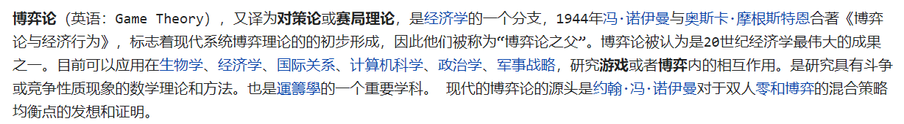
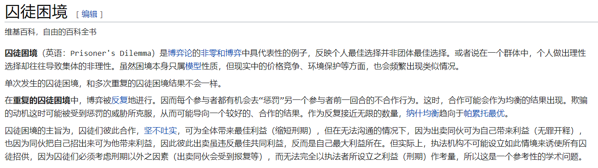
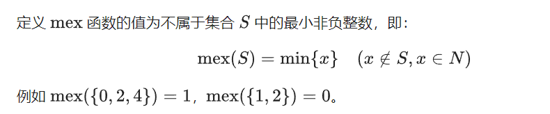
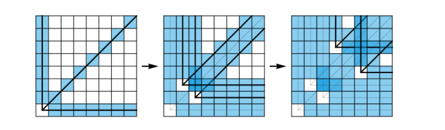
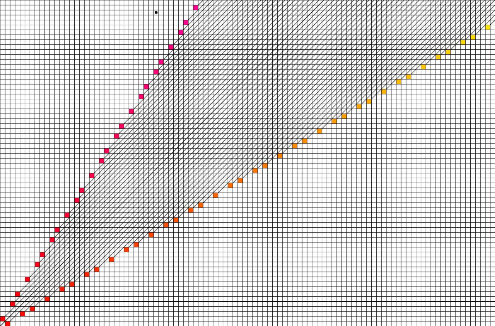
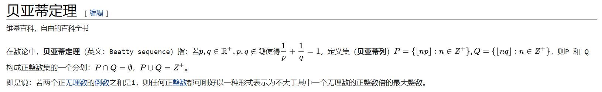

<!--
 * @Autor: violet apricity ( Zhuangpx )
 * @Date: 2021-09-24 15:10:59
 * @LastEditors: violet apricity ( Zhuangpx )
 * @LastEditTime: 2021-10-21 22:01:17
 * @FilePath: \apricitye:\桌面\ACM\数学\博弈论\简单博弈\简单博弈.md
 * @Description:  Zhuangpx : Violet && Apricity:/ The warmth of the sun in the winter /
-->

# 简单博弈入门和几种简单模型

博弈论( `GameTheory` ):



## 引入

### 囚徒困境

将囚徒困境作为博弈论的引入，因为它经典且多样。维基上如此描述：



### 公平组合游戏

公平组合游戏( `ICG:Impartial Combinatorial Games` )的定义如下：

- 游戏有两个人参与，二者轮流做出决策，双方均知道游戏的完整信息；

- 任意一个游戏者在某一确定状态可以作出的决策集合只与当前的状态有关，而与游戏者无关；

- 游戏中的同一个状态不可能多次抵达，游戏以玩家无法行动为结束，且游戏一定会在有限步后以非平局结束。

大部分的棋类游戏**不是**公平组合游戏，如国际象棋、中国象棋、围棋、五子棋等（因为双方都不能使用对方的棋子）。

### 必胜态和必败态

到达某一状态之后该玩家必胜(败)。可抽象成图，例如到达某点之后下一个点就是终点。

### 有向图游戏和SG函数

先引入一个`mex`运算，表示非负整数集合中未出现的最小非负整数：



然后是**有向图游戏**：

>有向图游戏是一个经典的博弈游戏——实际上，大部分的公平组合游戏都可以转换为有向图游戏。
>
>在一个有向无环图中，只有一个起点，上面有一个棋子，两个玩家轮流沿着有向边推动棋子，不能走的玩家判负。

再来定义`SG`函数：

>对于某个点`x`，`SG(x)`决定于`x`的后续状态。
>如果`x`是终点那么`SG(x)=0`。
>如果`x`不是终点且后继状态为 `y1,y1,~,yk` 那么`SG(x)=mex{SG(y1),SG(y2),~,SG(yk)}`。

如果将`SG`函数与有向图结合(即若干张有向游戏图分别用`SG`函数表示，设起点为`x[i]`)，假定终点为必败态，那么就有以下**SG定理(Sprague-Grundy Theorem)**：

>`s=SG(x1)^SG(x2)~~~SG(xn)`：
>
>- `s=0`：先手必败
>- `s!=0`：先手必胜

于是引出了 **有向图游戏的和** 的概念：设 `G1,G2,G3,~Gm` 是若干个有向图游戏，定义有向图游戏 `G` 它的规则是任选某个 `Gi` 并在上面行动一步，称 `G` 为这若干个有向图游戏的和，并且其 `SG` 函数的值等于这若干个 `SG` 函数值的异或和。当 `SG==0` 为必败局面，反之为必胜局面。

## 几种经典模型

### Nim游戏(尼姆游戏)

规则如下：

>`n`堆物品，每堆有`a[i]`个，两个玩家轮流取走任意一堆的任意个物品，但不能不取，最后无法操作的人失败，或者说取走最后物品的人胜利。

结论如下：

>令`s=a[1]^a[2]~~a[n-1]^a[n]`。
>
>- `s=0`：先手必败
>- `s!=0`：先手必胜

证明如下：

>1.`0^0~~~0^0=0`：此时先手必败(无法取)。
>2.`s!=0`：此时可以证明通过**某种方式**使取后`s=0`。
>3.`s=0`：此时可以**证明**任意取后`s!=0`。
>4.那么两个玩家可以保持双方`s`是否为`0`，而当全部为`0`时就到了必败态(只有s=0才能结束游戏)。

上面第二点说的**某种方式**如下：

>`s=x!=0`，假设`k`最高位的1在`k`位，找出某个`a[i]`的`k`位为1，那么`a[i]>a[i]^x`，于是令`a[i]=a[i]^x`从而使`s=s^x=x^x=0`。

上面第三点说的**证明**如下：

>反证法：将`a[i]`改为`a[ii]`后得到`ss=0`，那么应该有`s^ss=0`即`a[i]^a[ii]=0`，显然不正确。

题目：

> [51nod/1069:Nim游戏](http://www.51nod.com/Challenge/Problem.html#problemId=1069)

### 巴什博弈(BashGame)

规则如下：

>有 `1` 堆石子，总个数是 `n` ，两名玩家轮流在石子堆中拿石子，每次至少取 `1` 个，至多取 `m` 个。取走最后一个石子的玩家为胜者。判定先手和后手谁胜。

结论如下：

>若 `n%(m+1)==0` 先手必败，否则先手必胜。

证明如下：

>1.当 `n<=m` 显然先手胜利(一次取完)。
>2.当 `n==m+1` 先手取多少个后手都能取完。
>3.若 `n%(m+1)==0` 假设先手取 `x` 个，那么后手可以取 `(m+1)-x` 个使得局面再次成为 `(m+1)` 的倍数，那么直到最后一次将会把 `n==m+1` 的局面留给先手，于是又回到了情况2，反之先手可以取余数个使得 `n%(m+1)==0` 的局面留给后手(后手必败)。

题目：

> [51nod/1066:BashGame](http://www.51nod.com/Challenge/Problem.html#problemId=1066)

### 威佐夫博弈(WythoffGame)

规则如下：

>有两堆石子，石子数可以不同。两人轮流取石子，每次可以在一堆中取，或者从两堆中取走相同个数的石子，数量不限，取走最后一个石头的人获胜。判定先手是否必胜。

结论如下：

> 假设 `a<b` ，当 `(b-a)*((sqrt(5.0)+1.0)/2.0)==a` 时先手必败，否则先手必胜。（差值与小者是否满足黄金分割数）
> 这里的 `(sqrt(5.0)+1.0)/2.0` 就是黄金分割数(大约是1.618)。

证明如下：

> 把两堆石子数量 `x,y` 映射到二维坐标系 `(x,y)` 上，并假设 `x<=y` 。将先手必败的点成为 **奇异节点** 此时局势称为 **奇异局势** 。(此时博弈就变成了挪动皇后游戏)
> 首先容易知道 `(0,0)` 是第一个奇异节点。考虑到**能一步到达奇异节点的都不是奇异节点**，那么对于每个奇异节点 `(x,y)` 能够将 `(x+k,y+k),(x,y+k),(x+k,y)` 都划分为非奇异节点(对应画出三条直线)，于是可以通过递推从小到大枚举出每个奇异节点。
> 
> 
>>
>> ```c++
>>   0     1     2     3     4     k
>> (0,0) (1,2) (3,5) (4,7) (6,10) ···
>> (a[i],b[i]) ==> a[i]=mex(a[0~i-1],b[0~i-1]) b[i]=a[i]+i
>> a[i] = i * 1.618
>> 这里默认向下取整
>> ```
>
> 发现规律：差值 `y-x` 从0开始递增(**差值唯一**)，而 `x` 取的是前面所有数的 `mex` 。
>> 这里可以反证法证明一下第一个规律：假设存在两个奇异节点 `A(a,a+k),B(b,b+k)` 即差值不唯一，那么对于 `B` 可以通过 `(b-a,b-a)` 操作转移到 `A` 局势，因而 `B` 应该是必胜局势，与前提矛盾，证毕。
> 其次再引入一个 **贝亚蒂定理(BeattySequence)** ：
>> 
> 假设有 `[a*n]+n=[b*n],1/a+b/a=1,` 易得 `[a*n]+n=[a*n+n]=[a*(n+1)]=[b*n]` 带入解出 `a=(1+sqrt(5))/2=1.618` 也就是黄金分割数。
> Wythoff本人将其归纳为：
>> 所有这样的数对从小到大依次为：
>> ([1 · φ], [1 · φ2]), ([2 · φ], [2 · φ2]), ([3 · φ], [3 · φ2]), ([4 · φ], [4 · φ2]), …
>> 其中 φ = (√5 + 1) / 2 ， [x] 表示不超过 x 的最大整数（当 x ≥ 0 时， [x] 可以简单地理解为取 x 的整数部分）。

### 斐波那契博弈(FibonacciGame)

规则如下：

> 一堆个数为 `n(n>=2)` 的石子，两人轮流取。
>> 先手不能在第一次取完，并且至少取一个(不能不取)。
>> 之后每次可以取至少一个至多为上一次对手所取的两倍。
> 取走最后一个的人为赢家，无法取的人失败。要求必败态。

结论如下：

> 当石子数位斐波那契数时，先手必败，否则先手必胜。

证明如下：

> 记 `f[i]` 表示第i个斐波那契数，显然当 `n==1||n==2` 时先手必败，先用数学归纳法证明(假设 `f[n-1],f[n-2]` 为必败态那么 `f[n]` 也为必败态)：
>> 假设 `N=f[n]=f[n-1]+f[n-2]` 由斐波那契数列容易得到 `f[n-1]<2*f[n-2]` 。
>>> 假设先手取 `x` 个，显然若 `x>=f[n-2]` 那么后者可以取最多 `y=f[n]-x<=f[n-1]<f[n-2]*2` 也就是能够全部取完，因此先手只能取 `x<f[n-2]` 于是可以把石子分为两堆，先手只能先取 `f[n-2]` 那堆且取不完，即此堆为 `A` 。
>>> 假设先手取 `x>=f[n-2]/3` ，则 `A<2*x` 后者能取完 `A` 并且取 `y=f[n-2]-x<2/3*f[n-2]` ，比较 `2/3*f[n-2]` 和 `1/2*f[n-1]` 发现 `y<2/3*f[n-2]<1/2*f[n-1]` 也就是先手此时只能在 `f[n-1]` 取且取不完，那么就回到了 `N=f[n-1]` 的必败态。
>
> 再来证明 `N!=f[n]` 的情况。这里引入 **齐肯多夫定理(Zeckendorf)** ：
>> 对于任何正整数 `N` 都可以表示成若干个**不连续的斐波那契数的和**。即 `N=f[a1]+f[a2]+~+f[ap](ai-aj>1)` 。
>
> 于是可以把 `N` 按这种方法按大到小分成若干堆(因为不连续所以 `f[a[i]]>2*f[a[i+1]]` )。那么先手先取完最小的那堆留下若干个 `N=f[i]` 且取不完的必败态局面给后手，因此先手必胜。

## SG游戏

### Anti-SG游戏(走完最后一步者输)

#### Anti-Nim游戏

规则：有 `n` 堆石子，两个人可以从任意一堆石子中拿任意多个石子(不能不拿)，拿走最后一个石子的人失败。

结论如下：

先手必胜态当且仅当：

- **任意**堆石子数为1且游戏的 `SG` 值**为0**。
- **存在**某堆石子数不为1且游戏的 `SG` 值**不为0**。

接下来考虑证明这个结论。将游戏分为三种情况。

首先易得某堆石子的 `SG` 指就是其石子数。

- 每堆石子数都是1

显然每堆石子的 `SG` 都是1，当异或和(游戏和的 `SG` )为0时有偶数堆，先手必胜。反之先手必败。

- 一堆石子数大于1，其他石子数等于1，先手必胜

显然先手可以对这堆石子进行操作，使得局面回到了石子数全是1的情况，并且他能决定此时石子堆数奇偶，于是先手留下必败局面给后手从而先手必胜。

- 存在多堆石子数大于1

异或和为0时先手必败，否则先手必胜。

TODOSG游戏

## 参考资料和文献

[Matrix67:捡石子游戏,Wythoff数表和一切的Fibonacci数列](http://www.matrix67.com/blog/archives/6784)

[繁凡的博弈论全家桶](https://blog.csdn.net/weixin_45697774/article/details/113874771?ops_request_misc=%257B%2522request%255Fid%2522%253A%2522163454365916780262598027%2522%252C%2522scm%2522%253A%252220140713.130102334..%2522%257D&request_id=163454365916780262598027&biz_id=0&utm_medium=distribute.pc_search_result.none-task-blog-2~all~top_click~default-2-113874771.pc_search_ecpm_flag&utm_term=%E5%8D%9A%E5%BC%88%E8%AE%BA&spm=1018.2226.3001.4187)
