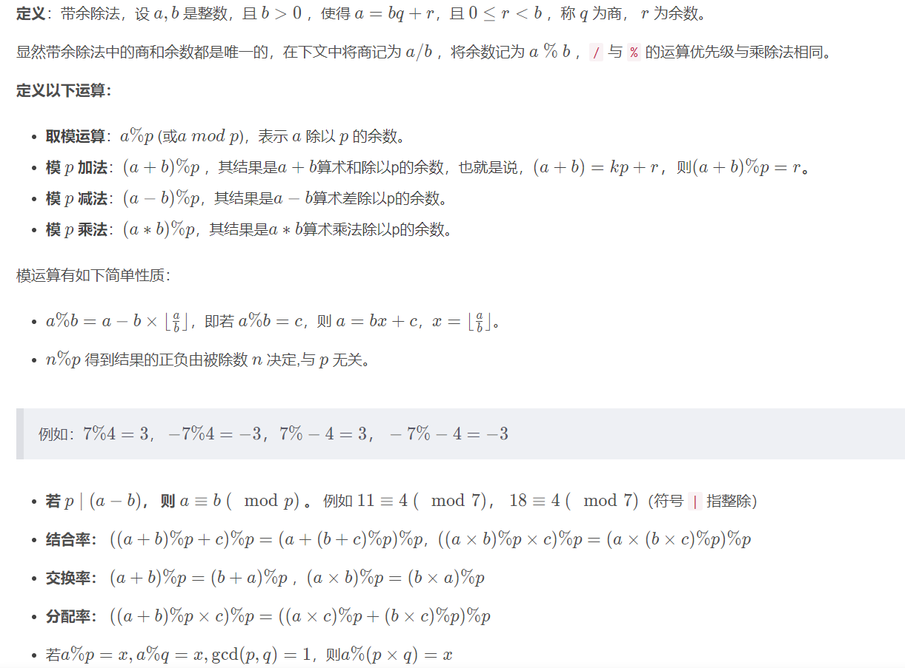
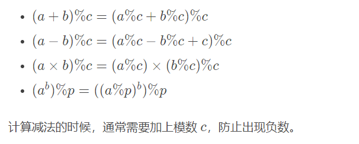
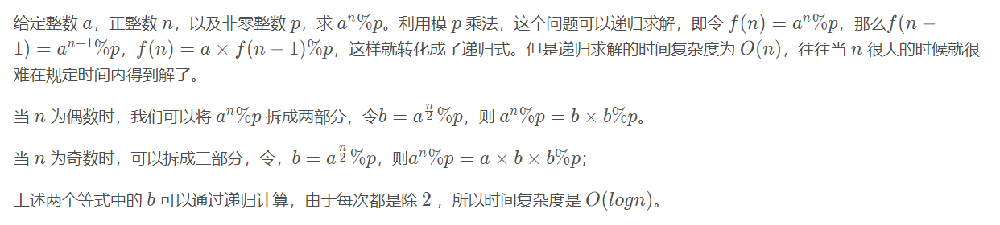

<!--
 * @Autor: violet apricity ( Zhuangpx )
 * @Date: 2021-10-30 19:27:42
 * @LastEditors: violet apricity ( Zhuangpx )
 * @LastEditTime: 2021-10-30 20:13:45
 * @FilePath: \apricitye:\桌面\ACM\数学\数论\同余\同余.md
 * @Description:  Zhuangpx : Violet && Apricity:/ The warmth of the sun in the winter /
-->

# 同余相关

## 整数的带余运算

### 整数的取余运算(模运算)



### 模意义下的加减乘除四则运算



- 快速幂

在求大数的幂时通常会取模，此时可以将幂次按二进制分解，降低乘方复杂度。在算法竞赛里有一种经典的快速幂算法来解决此类问题。



```c++
//c++ version
#define ll long long  // long long
ll qpow(ll a,ll b,ll p) // a^b % p
{
    ll ans=1;
    while(b){
        if( b&1 ) ans=(ans*a)%p;
        a=(a*a)%p;
        b>>=1;
    }
    return ans%p;
}
```

- 龟速乘

考虑两数相乘并取模，当乘数过大，即使取模也会爆掉数据，于是有了**龟速乘**，用加分模拟乘法，此时能够不断取模保证数据不爆，同时花费了更多时间。形式上龟速乘与快速幂极为相似，并且经常与其搭配使用。

```c++
//c++ version
#define ll long long   // long long
ll smul(ll a,ll b,ll p)
{
    if(b<0) a=-a,b=-b;
    ll ans=0;
    while(b){
        if( b&1 ) ans=(ans+a)%p;
        a=(a+a)%p;
        b>>=1;
    }
    return ans%p;
}
//another version
inline ll smul(ll a,ll b,ll p)
{
    if(b<0) a=-a,b=-b;
    ll x=(long double)a/p*b;
    ll ans=(unsigned long long) a*b - (unsigned long long) x*p;
    return (ans+p)%p;
}
```

- 大数快速幂

当幂次极大时普通快速幂会爆，于是有了大数快速幂。

```c++
//c++ version
typedef long long ll;   // long long
#define mod 1000000007  // mod
ll q_pow(ll a, ll b)    // 内置快速幂
{
    ll ans = 1;
    while (b)
    {
        if (b & 1)
        {
            ans = (ans * a) % mod;
            b--;
        }
        b /= 2;
        a = a * a % mod;
    }
    return ans % mod;
}
ll qpow(ll a, char *b, int len)  //外置大数快速幂
{
    ll ans = 1;
    while (len > 0)
    {
        if (b[len - 1] != '0')
        {
            int s = b[len - 1] - '0';
            ans = ans * q_pow(a, s) % mod;
        }
        a = q_pow(a, 10) % mod;
        len--;
    }
    return ans % mod;
}
int main()
{
    int n;
    cin >> n;
    string s;
    cin >> s;
    int len = s.size();
    cout << qpow(n, s, len) << '\n';   // a^s % mod
    return 0;
}
```

## 同余

### 所谓同余
