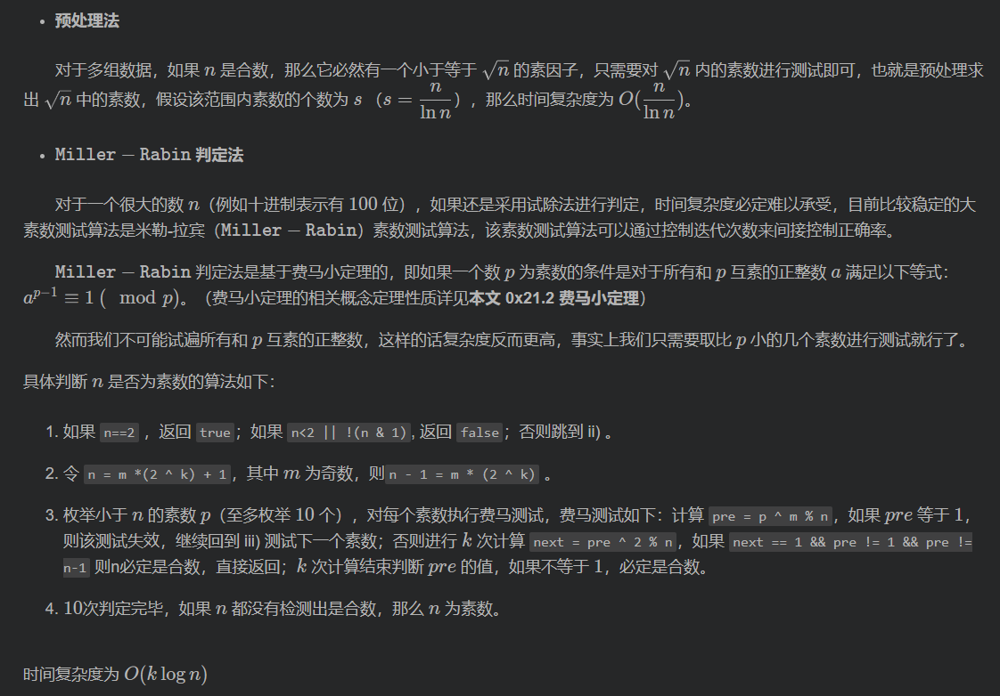
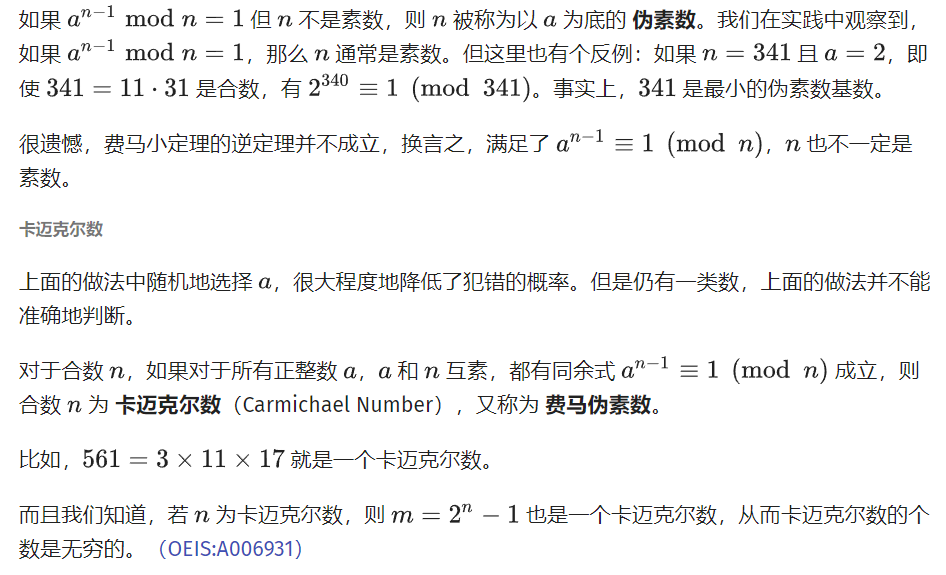
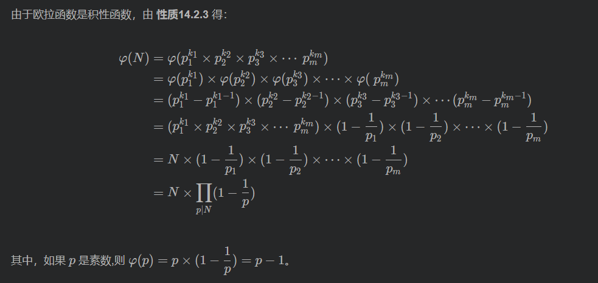
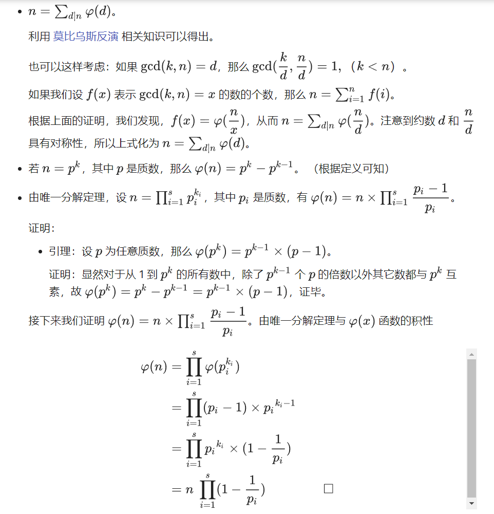

<!--
 * @Autor: violet apricity ( Zhuangpx )
 * @Date: 2021-10-20 11:45:53
 * @LastEditors: violet apricity ( Zhuangpx )
 * @LastEditTime: 2022-09-22 13:22:27
 * @FilePath: \apricitye:\桌面\ACM\数学\数论\数论基础（整除出发）\数论基础（整除出发）.md
 * @Description:  Zhuangpx : Violet && Apricity:/ The warmth of the sun in the winter /
-->

# 数论基础（整除出发）

从整除相关的知识出发开始学习数论，至于原因，不谈体系，至少对我而言最开始接触的数论知识就是欧几里得，并且我学习的第一个算法也是扩展欧几里得，而欧几里得应该说从整除起步，于是决定从这里开始学习数论基础，另一个原因是参考文章也是如此。文末有参考链接(繁凡orz)。

## 整除

**定义**：整数 `n` 除以整数 `d` 余数为0，即 `d` 能整除 `n` ，称 d 是 `n` 的约数(因数)，`n` 是 `d` 的倍数，记为 $d \mid n$ 。

并且能够引出以下**性质**：


其中几条在竞赛中较为重要，常做推导，优化和中间转换：


其中第五条补充证明：


## 带余除法

有整除必然有非整除，因此就有带余除法(欧几里得除法)，oiwiki这样总结：


实际上带余除法也可扩展至实数范围

## 质数(素数)


### 质数判定

考虑如何判定质数

- 暴力试除法

判断一个数是否为质数最粗暴的方法就是讨论比它小的数是否是它的因数，也就是**枚举因数**，因为因数肯定是成对存在的( `a*b=n` )，因此第一个优化显然可以考虑枚举至 $\sqrt{n}$ 。此时时间复杂度是 $O(\sqrt{n})$ 。

```c++
bool is_prime(int x)
{
    if(x<2) return false;
    for(int i=2;i*i<=x;i++)
    {
        if(x%i==0) return false;
    }
    return true;
}
```

考虑将枚举的因数优化，只枚举质因子(合数因子肯定有质数因子)。于是有了以下这种 `k*n+1` 法。


```c++
bool is_prime(long long x)
{
    if(n==2||n==3||n==5) return 1;
    if(n%2==0||n%3==0||n%5==0) return 0;
    long long d=(6+1);
    long long add[8]={4,2,4,2,4,6,2,6};
    // 6+1 6+5  2*6+1 2*6+5  3*6+1 3*6+5 -----> k*6+i
    while(d*d<=n) for(auto i:add) { if(n%d==0) return 0; d+=i; }
    return 1;
}
```

- 预处理

一种名为 `MillerRabin` 的**素数测试**，针对单个数字快速测试。



```c++
typedef long long ll;

ll Rand()
{
    static ll x=(srand((int)time(0)),rand());
    x+=1000003;
    if(x>1000000007) x-=1000000007;
    return x;
}
bool Witness(ll a,ll n)
{
    ll t=0,u=n-1;
    while(!(u&1))u>>=1,t++;
    ll y,x=qpow(a,u,n);//快速幂
    while(t--){
        y=x*x%n;
        if(y==1&&x!=1&&x!=n-1) return 1;
        x=y;
    }
    return x!=1;
}
bool MillerRabin(ll n,ll s)
{
    if(n==2||n==3||n==5) return 1;
    if(n%2==0||n%3==0||n%5==0) return 0;
    while(s--){
        if(Witness(Rand()%(n-1)+1,n)) return 0;
    }
    return 1;
}
```

### 素数测试

上述提到 `MillerRabin` 是一种素数测试方法，先讨论什么是素数测试。


再来介绍几种概率性素数测试：

- `Fermat` 素性测试

理论依据来源于费马小定理，思想在于不断选取 `[2,n-1]` 中的基 `a` 并检验每次是否有 `a^(n-1)==1 (mod n)` 。

```c++
// C++ Version
bool millerRabin(int n) {
  if (n < 3) return n == 2;
  // test_time 为测试次数,建议设为不小于 8
  // 的整数以保证正确率,但也不宜过大,否则会影响效率
  for (int i = 1; i <= test_time; ++i) {
    int a = rand() % (n - 2) + 2;
    if (quickPow(a, n - 1, n) != 1) return 0; // 快速幂
  }
  return 1;
}
```

然而其正确性并不能保证。



- `Miller-Rabin`  素性测试

即上述说提到的。


```c++
// C++ Version
bool millerRabin(int n) {
  if (n < 3 || n % 2 == 0) return n == 2;
  int a = n - 1, b = 0;
  while (a % 2 == 0) a /= 2, ++b;
  // test_time 为测试次数,建议设为不小于 8
  // 的整数以保证正确率,但也不宜过大,否则会影响效率
  for (int i = 1, j; i <= test_time; ++i) {
    int x = rand() % (n - 2) + 2, v = quickPow(x, a, n); // 快速幂
    if (v == 1) continue;
    for (j = 0; j < b; ++j) {
      if (v == n - 1) break;
      v = (long long)v * v % n;
    }
    if (j >= b) return 0;
  }
  return 1;
}
```

### 质数筛

所谓的筛其实是筛选的意思，质数筛即通过某种方法筛选出质数和合数，并且预处理出来。通过合适的筛法可以高效率地预处理出质数表。

- Eratosthenes 筛法 （埃拉托色尼筛法）

简称埃式筛。对于一个数无论是否为质数，其倍数一定是合数，于是可以从小到大枚举数字，对其倍数标记为合数，从而达到筛的效果。此法可以对一个数判断也可以作为预处理。因为合数肯定有质数因子，所以可以只对质数进行倍增筛。

关于复杂度的证明，比较繁琐，具体见文末链接。

```c++
const int N=1e5;
int vis[N],pri[N],pcnt;
void Eprime(int n)
{
    for(int i=2;i<=n;i++){
        if(vis[i]) continue;
        else {
            pri[++pcnt]=i;
            for(int j=i*2;j<=n;j+=i){
                vis[j]=1;
            }
        }
    }
}
```

- 欧拉筛(线性筛)

发现埃氏筛对于每个数可能被多个数重复筛到，因此复杂度比较高，考虑每个数只筛一遍，从而将复杂度将到线性的 `O(n)` 。

首先从小到大筛，并及时存下质数 `pri[j]` ，当倍增筛合数时第一个满足 `i%pri[j]==0` 的合数的最小质因子显然是 `pri[j]` ，并且 `i*pri[j]` 的最小质因子也是 `pri[j]` ，由于 `pri[j]` 是递增的，因此 `i*pri[j+1]` 的最小质因子应该是 `i` 的最小质因子也就是 `pri[j]` 而不是 `pri[j+1]` 因此在此处及时 `break` 。

对于任意合数，枚举到最小质因子之前显然能把它筛去，因此能保证所有数不漏掉。

由于每个数只会筛一次(**合数由最小质因子筛去**)，因此时间复杂度是 `O(n)` 的。这里筛合数时利用了最小质因子，在求**欧拉函数**时也有相同作用。

```c++
const int N=1e3;
int pri[N],pcnt;
bool pvis[N];
void euler_prime(int n)
{
    for(int i=2;i<=n;++i){
        if(!pvis[i]) pri[++pcnt]=i;
        for(int j=1;i*pri[j]<=n;++j){
            vis[i*pri[j]]=1;
            if(i%pri[j]==0)break;
        }
    }
}
```

### 反素数

如果某个正整数 `n` 满足以下条件则称为**反素数**：任何小于 `n` 的正数的约数个数都**小于** `n` 的约数个数。

可以认为素数是一种因子最少的数(1和它本身)，那么反素数就是因子最多的数(且在因子个数一样时最小)，因此反素数是相对于一个集合而言的。

根据唯一分解定理可以得到反素数的求值方法。


当然这里给集合元素绝对值作了限制(有限集合)，当最大值更大时应该灵活变化。

实例题目及代码：

```c++
//c++ version
/*
    Number With The Given Amount Of Divisors (CF27E) : https://codeforces.com/problemset/problem/27/E
    求因子数一定(n)的最小正整数(反素数)
*/
#include<iostream>
using namespace std;
#define ULL unsigned long long
#define INF ~(0ull)
ULL p[16]={ 2, 3, 5, 7, 11, 13, 17, 19, 23, 29, 31, 37, 41, 43, 47, 53 };
ULL ans,n;
// depth: 当前在枚举第几个素数
// num: 当前因子数
// temp: 当前因子数量为 num 的时候的数值
// up：上一个素数的幂，这次应该小于等于这个幂次
void dfs(ULL depth, ULL temp, ULL num, ULL up)
{
    if (num > n || depth >= 16) return;
    if (num == n && ans > temp) {
        ans = temp; return;
    }
    for (int i = 1; i <= up; i++) {
        if (temp / p[depth] > ans) break;
        dfs(depth + 1, temp = temp * p[depth], num * (i + 1), i);
    }
}
int main()
{
    while(cin>>n){
        ans=INF;
        dfs(0,1,1,64);
        cout<<ans<<'\n';
    }
    return 0;
}
```

## 唯一分解定理(算数基本定理)

首先有**算数基本引理**：


其次引出**算数基本定理**，也称为**唯一分解定理**：


依据唯一分解定理可以将任意正整数按乘积分解。

关于其证明，如下：


接下来考虑根据这一定理对正整数**质因数分解**。

- 试除法

每个质数只一次，枚举时将其除尽，如此其倍数也会筛去。类似埃式筛。

```c++
const int N=1e3;
int c[N],p[N];
void divide(int n)
{
    int cnt=0;
    for(int i=2;i*i<=n;++i){
        if(n%i==0){
            p[++cnt]=i;
            c[cnt]=0;
            while(n%i==0) n/=i,c[cnt]++;
        }
    }
    if(n>1)p[++cnt]=n,c[cnt]=1;
    // n = sum { p[i]^c[i] } (1<=i<=cnt)
}
```

- Pollard Rho 算法

考虑大数据高效率分解。引入 `Pollard rho` 算法。

作为一个**随机算法**(随机大法好.jpg)， `Pollard rho` 能在 `O(n^(1/4))` 时间内找到一个数的质因子，然后再递归(除以改质因子)至质数，即可达到筛质数的效果(复杂度有点玄学)。算法策略如下：


贴道[洛谷的模板题](https://www.luogu.com.cn/problem/P4718)，(板子也是繁凡大佬的,我是懒狗)

```c++
typedef long long ll;
const int N = 1e5 + 7;
ll x, y, a[N];
ll max_factor;
struct BigIntegerFactor {
    const static int N = 1e6 + 7;
    ll prime[N], p[N], fac[N], sz, cnt; //多组输入注意初始化cnt = 0
    inline ll mul(ll a, ll b, ll mod) {          //WA了尝试改为__int128或慢速乘
        if (mod <= 1000000000)
            return a * b % mod;
        return (a * b - (ll)((long double)a / mod * b + 1e-8) * mod + mod) % mod;
    }
    void init(int maxn) {
        int tot = 0;
        sz = maxn - 1;
        for (int i = 1; i <= sz; ++i)
            p[i] = i;
        for (int i = 2; i <= sz; ++i) {
            if (p[i] == i)
                prime[tot++] = i;
            for (int j = 0; j < tot && 1ll * i * prime[j] <= sz; ++j) {
                p[i * prime[j]] = prime[j];
                if (i % prime[j] == 0)
                    break;
            }
        }
    }
    ll qpow(ll a, ll x, ll mod) {
        ll res = 1ll;
        while (x) {
            if (x & 1)
                res = mul(res, a, mod);
            a = mul(a, a, mod);
            x >>= 1;
        }
        return res;
    }
    bool check(ll a, ll n) {                     //二次探测原理检验n
        ll t = 0, u = n - 1;
        while (!(u & 1))
            t++, u >>= 1;
        ll x = qpow(a, u, n), xx = 0;
        while (t--) {
            xx = mul(x, x, n);
            if (xx == 1 && x != 1 && x != n - 1)
                return false;
            x = xx;
        }
        return xx == 1;
    }
    bool miller(ll n, int k) {
        if (n == 2)
            return true;
        if (n < 2 || !(n & 1))
            return false;
        if (n <= sz)
            return p[n] == n;
        for (int i = 0; i <= k; ++i) {            //测试k次
            if (!check(rand() % (n - 1) + 1, n))
                return false;
        }
        return true;
    }
    inline ll gcd(ll a, ll b) {
        return b == 0 ? a : gcd(b, a % b);
    }
    inline ll Abs(ll x) {
        return x < 0 ? -x : x;
    }
    ll Pollard_rho(ll n) {                 //基于路径倍增的Pollard_Rho算法
        ll s = 0, t = 0, c = rand() % (n - 1) + 1, v = 1, ed = 1;
        while (1) {
            for (int i = 1; i <= ed; ++i) {
                t = (mul(t, t, n) + c) % n;
                v = mul(v, Abs(t - s), n);
                if (i % 127 == 0) {
                    ll d = gcd(v, n);
                    if (d > 1)
                        return d;
                }
            }
            ll d = gcd(v, n);

            if (d > 1)
                return d;
            s = t;
            v = 1;
            ed <<= 1;
        }
    }
    void getfactor(ll n) {                         //得到所有的质因子(可能有重复的)
        if (n <= sz) {
            while (n != 1)
                fac[cnt ++ ] = p[n], n /= p[n];
            max_factor = max_factor > p[n] ? max_factor : p[n];
            return;
        }
        if (miller(n, 6)) {
            fac[cnt ++ ] = n;
            max_factor = max_factor > n ? max_factor : n;
        }
        else {
            ll d = n;
            while (d >= n)
                d = Pollard_rho(n);
            getfactor(d);
            getfactor(n / d);
        }
        return ;
    }
} Q;
int main() {
    //Q.init(N - 1);//如果代码超时且仅需要分解大数的质因数可以用这句话，否则不要用
    ll T, n;
    scanf("%lld", &T);
    while (T--) {
        max_factor = -1;
        scanf("%lld", &n);
        Q.getfactor(n);
        if(max_factor == n)
            puts("Prime");
        else printf("%lld\n", max_factor);
    }
    return 0;
}

```

## 约数与倍数

约束或称因数，由唯一分解定理可得以下结论：


考虑根据上式实现约数个数和约数和。

```c++
/*
如果 N = p1^c1 * p2^c2 * ... *pk^ck
约数个数： (c1 + 1) * (c2 + 1) * ... * (ck + 1)
约数之和： (p1^0 + p1^1 + ... + p1^c1) * ... * (pk^0 + pk^1 + ... + pk^ck)
*/
typedef long long ll
unordered_map<int,int>p;
void Devise(int n)
{
    //质数分解
    int x=n;
    for(int i=2;i<=x/i;++i){
        while(x%i==0)x/=i,p[i]++;
    }
    if(x>1)p[x]++;
    //约数个数
    ll cnt=1;
    for(auto elem:p) cnt=cnt*(elem.second+1);
    //约数和
    ll sum=1;
    for(auto elem:p){
        int f=elem.first,s=elem.second;
        ll res=1;
        while(s--) res=res*f+1;
        sum*=res;
    }
}
```

接下来考虑如何处理出约数来。

- 单个数约数-试除法

注意到约数成对存在，枚举约数去除即可。

```c++
vector<int>factor;
void get_factor(int x)
{
    for(int i=1;i*i<=x;++i){
        if(x%i==0) {
            factor.push_back(i)
            if(i!=x/i) factor.push_back(x/i);
        }
    }
}
```

- n以内约数-倍数法

按照埃式筛的形式以倍数加入约数。


```c++
const int N=1e3;
vector<int>factor[N];
void get_divide(int n)
{
    for(int i=1;i<=n;++i){
        for(int j=1;j*i<=n;++j){
            factor[i*j].push_back(j);
        }
    }
}
```

### 最大公约数

最大公约数即为 `Greatest Common Divisor` ，常缩写为 `gcd` 。记作 `gac(a,b)` 或简记 `(a,b)` 。

一般来说我们约定 **任何非零整数和零的最大公约数为它本身** 。

最大公约数是很常见的应用，在竞赛中也多有涉及。一些常用结论(性质)：


- 辗转相除法(欧几里得算法): `gcd(a,b)=gcd(b,a%b)`

大名鼎鼎的欧几里得算法( `Euclidean algorithm` )，也称为辗转相除法，通过递归地相除得到两个数的最大公约数。


时间复杂度 `O(log n)` 。

最坏情况：斐波那契数列相邻的两项，因为斐波那契数列相邻的两项一定互质。

欧几里德算法由于存在大量的取模运算，对于大整数耗时较大。

```c++
//递归
int gcd(int a,int b) // a >= b
{
    return b==0 ? a : gcd(b,a%b);
}
//迭代
int gcd(int a,int b)
{
    int d;
    while(b){
        d=b; b=a%b; a=d; // swap
    }
    return a;
}
```

- 更相减损法: `gcd(a,b)=gcd(a,a-b)`0

源于《九章算术》，算是最古老的最大公约数求法之一了。

证明：

> 令 `gcd(a,a-b)=d , a=x*d , a-b=y*d , gcd(x,y)=1` 则 `b=(x-y)*d` 那么 `gcd(a,b)=gcd(x*d,(x-y)*d)=d=gcd(a,a-b)` 。

- `Stein` 算法

渐近时间，空间复杂度均与欧几里德算法相同。

原理： `gcd(k*a,k*b)=k*gcd(a,b)` 。利用移位( `k=2` )和加减法避免了大整数取模。只有在大整数时才适用。

```c++
//递归
int stein(int a,int b)
{
    if(a<b) a^=b, b^=a, a^=b; //swap => a>=b
    if(b==0) return a;
    if( (!(a&1)) && (!(b&1)) ) return stein(a>>1,b>>1) << 1;
    else if( (a&1) && (!(b&1)) ) return stein(a,b>>1);
    else if( (!(a&1)) && (b&1) ) return stein(a>>1,b);
    else return stein(a-b,b);
}
//迭代
int stein(int a,int b)
{
    int k=1;
    while( (!(a&1)) && (!(b&1)) ){
        k<<=1; a>>=1; b>>=1;
    }
    //k=2^p
    while(!(a&1))a>>=1;
    while(!(b&1))b>>=1;
    if(a<b)a^=b, b^=a, a^=b; //swap
    while(a!=b){
        a-=b;
        if(a<b)a^=b, b^=a, a^=b; //swap
    }
    return k*a;
}
```

### 最小公倍数

两个数 `a` 和 `b` 的最小公倍数( `Leatest Common Multiple` )是指同时被 `a` 和 `b` 整除的最小倍数，记为 `lcm(a,b)` 。特殊的，当 `a` 和 `b` 互素时，`lcm(a,b)=a*b` 。


关于 `lcm` 和 `gcd` ，二者可以相互转化，证明如下：

> 对 `a,b` 质因数分解，得到若干质数 `p` 和对应指数 `k` ，那么 `lcm` 取 `min(ka,kb)` ，而 `gcd` 取 `max(ka,kb)` ，又 `ka+kb=min(ka,kb)+max(ka,kb)` 因此可以得到 `gcd(a,b)*lcm(a,b)=a*b` 。

于是在求 `lcm` 时可以直接利用 `gcd` 。如下：

```c++
//c++ version
int lcm(int a,int b)
{
    return a/gcd(a,b)*b;  // 先除后乘防溢出
}
```

### lcm与gcd一些定理


## 互质与欧拉函数

所谓互质即 `gcd(a,b)=1` 。注意到对于 **`int` 范围内**的数 `n` ，与其互质的数最多有**1600**个。

### 欧拉函数

欧拉函数指( `Euler's totient function` )**小于等于 `n` 且与 `n` 互质的数的个数**。

当 `n=p^k` 时有 `phi(n)=phi(p^k)=n-n/p=p^k-p^(k-1)=(p-1)*p^(k-1)=(1-1/p)*p^k` 。

如果 `n` 本身是质数的话，那么显然 `phi(n)=phi(p)=p*(1-1/p)=p-1-n-1` (除了 `n` 以外的数都和 `n` 互质)。


值得一提的是欧拉函数是**积性函数**，因此在根据上面的式子在函数值上有如下转化：



这就是经典的**欧拉函数公式**，事实上它的证明还可以利用**容斥原理**：

> 考虑将 `n` 按唯一分解定理质因数分解，如果能把 `1~n` 内所有是 `p[i]` 的倍数的数找出来，那么剩下的数就是和 `n` 互质的数，因此问题转化为如何筛去 `1~n` 内所有是 `p[i]` 的倍数的数即筛去 `k(k%p==0)` 。考虑利用容斥定理，总数为 `n` ，先减去 `p[i]` 的倍数部分的数，再加上 `p[i]*p[j]` 的倍数部分的数，再减去 `p[i]*p[j]*p[k]` 的倍数部分的数，以此类推，

#### 欧拉函数的一些性质

- **积性函数**

当 `gcd(a,b)=1` 时，有 `phi(a*b)=phi(a)*phi(b)` ，称此类有性质的函数为积性函数，事实上积性函数就是由欧拉函数拓展到一般函数的。

- 偶数性质


- 和性质


- 其他性质




#### 欧拉函数的求值


- 单个数的欧拉函数(唯一分解定理)

根据上述式子，对某个数质因数分解即可求出其欧拉函数值。

```c++
//c++ version
inline int euler_phi(int n)
{
    int ans=n;
    for(int i=2;i*i<=n;i++){
        if(n%i==0){
            ans=ans/i*(i-1); //euler_phi
            while(n%i==0)n/=i;
        }
    }
    if(n>1)ans=ans*n*(n-1);  //left
    return ans;
}
```

- 筛法求 `n` 以内的欧拉函数

根上述容斥原理，可以利用筛法处理出质数来，同时处理出欧拉函数来。

首先若 `n=p` 则 `phi[n]=n-1` 。
设 `n=p[j]*i` 当 `i%p[j]==0` ，那么 `n` 和 `i` 的质因子种类上是一样的，显然有 `phi[n]=phi[p[j]*i]=p[j]*phi[i]` 。
当 `i%p[j]!=0` 则 `n` 比 `i` 多了 `p[j]` 这一种质因子，以此有 `phi[n]=phi[p[j]*i]=phi[i]*(p[j]-1)` 。

注意到此时欧拉函数是通过递推得到的，一般规定 `phi[1]=1` 。

```c++
//c++ version
typedef long long ll; //long long
const int N=1e6+5;      //maxn
ll phi[N];
int pri[N],pcnt;
bool pvis[N];
void getphi(int n)
{
    phi[1]=1ll;   //规定边界
    for(int i=2;i<=n;++i){
        if(!pvis[i]){
            phi[i]=i-1;   //phi[p]=p-1
            pri[++pcnt]=i;
        }
        for(int j=1;pri[j]<=n/i;++j){
            pvis[i*pri[j]]=1;
            if(i%pri[j]) { phi[i*pri[j]]=phi[i]*(pri[j]-1)*1ll; }
            else { phi[i*pri[j]]=phi[i]*pri[j]*1ll; break; }
        }
    }
}
```

## 一些定理


# 参考

[繁凡](https://fanfansann.blog.csdn.net/article/details/113797542#0x11__89)(郑重鸣谢膜拜，写的实在太好了)

[OiWiki](https://oi-wiki.org/)
