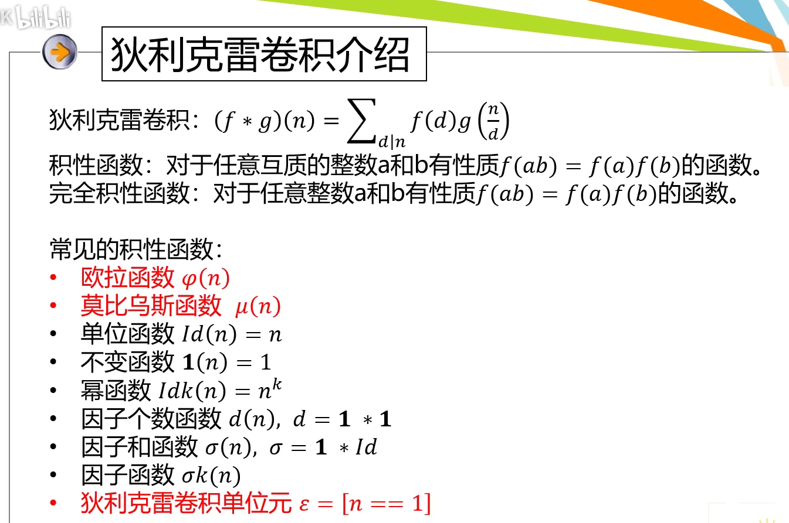
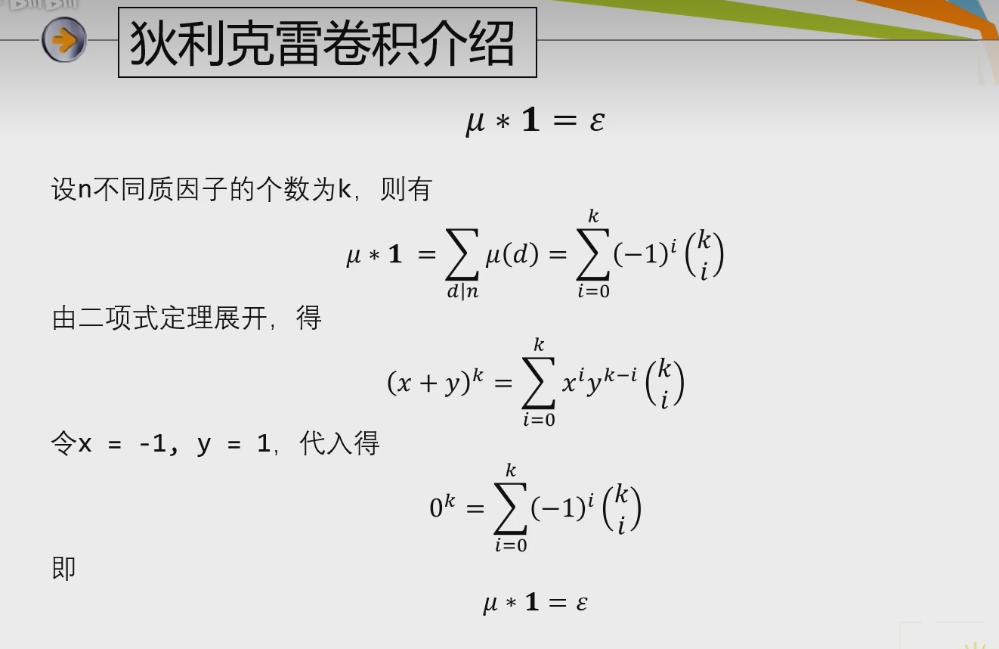
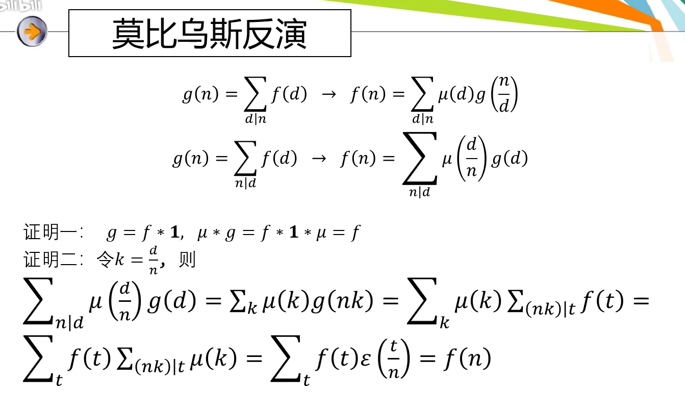
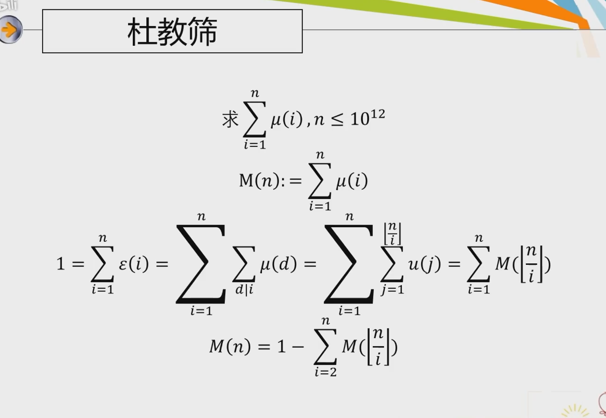
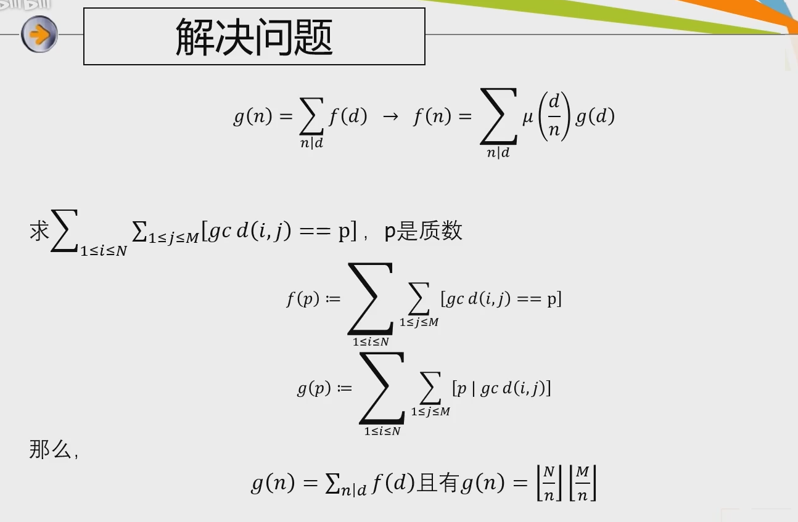
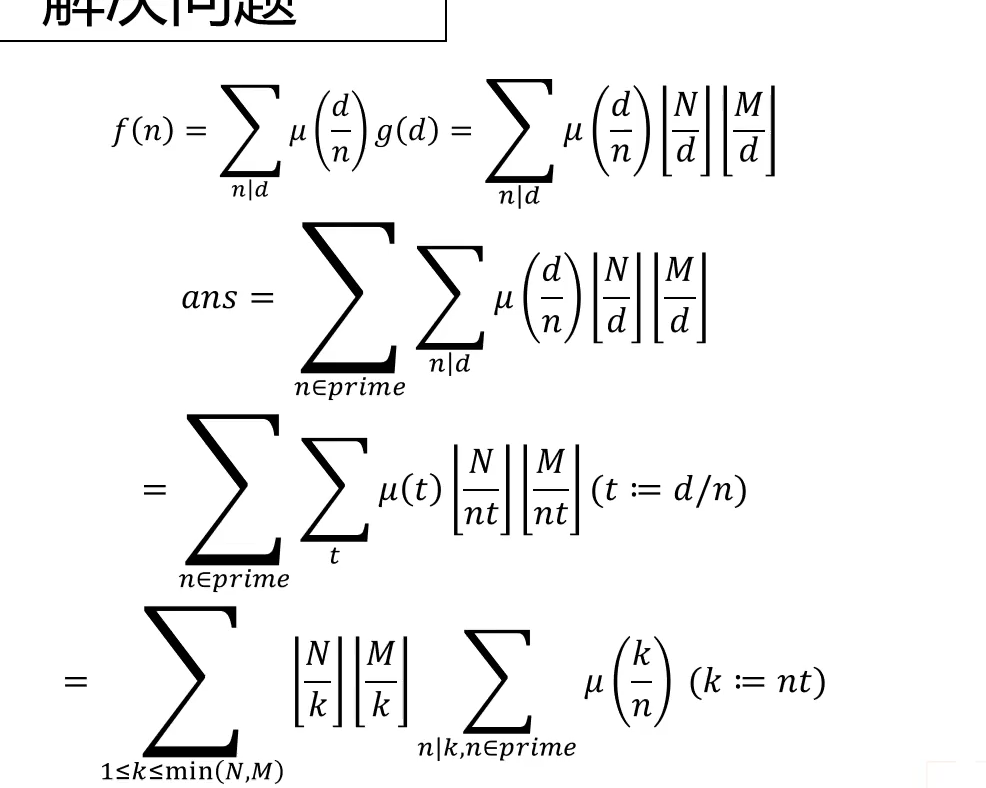
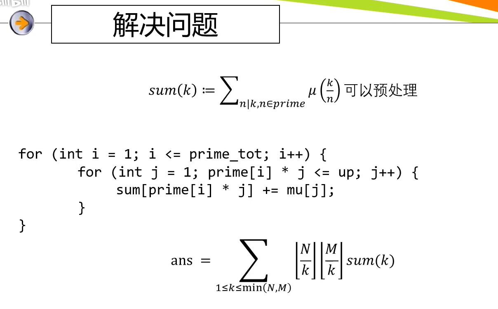
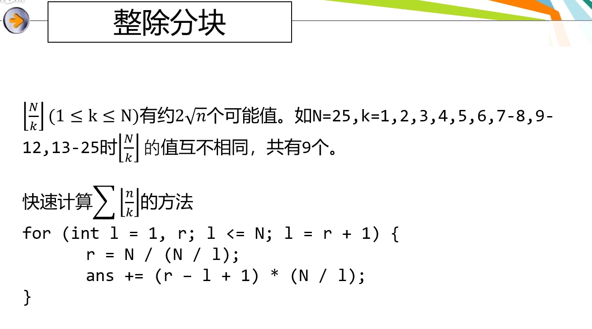

<!--
 * @Autor: violet apricity ( Zhuangpx )
 * @Date: 2022-09-21 17:10:35
 * @LastEditors: violet apricity ( Zhuangpx )
 * @LastEditTime: 2022-10-25 10:27:13
 * @FilePath: \apricitye:\桌面\ACM\数学\数论\莫比乌斯函数\莫比乌斯函数.md
 * @Description:  Zhuangpx : Violet && Apricity:/ The warmth of the sun in the winter /
-->

# 莫比乌斯函数

<https://blog.csdn.net/qq_45874328/article/details/116260119>

```markdown
f[n] = 1        if n==1
f[n] = 0        if n还有平方因子(存在质因子幂大于1)
f[n] = (-1)^k   if k==n本质不同质因子的个数
```

## 性质

## 线性筛求莫比乌斯函数

因为是积性函数，所以可以线性筛求

```c++
//  线性筛-莫比乌斯函数
int mu[N], pri_p[N], vis_p[N];
int cnt_p;
void get_mu(int lim)
{
    mu[1] = 1;
    for(int i=2;i<=lim;i++) {
        if(!vis_p[i]) pri_p[++cnt_p] = i, mu[i] = -1;
        for(int j=1;j<=cnt_p&&i*pri_p[j]<=lim;j++) {
            vis_p[i*pri_p[j]] = 1;
            if(i%pri_p[j]==0) {
                mu[i*pri_p[j]] = 0;
                break;
            }
            else mu[i*pri_p[j]] = -1*mu[i];
        }
    }
}
```

## 狄利克雷卷积



就是对因子对的一个配对卷积

比较重要的：**狄利克雷卷积单位元**

以及莫比乌斯函数的逆元就是不变函数(莫比乌斯函数和不变函数卷积得到单位元)：



## 莫比乌斯反演

两种反演方式：



白话就是对于g(n)比较难求，而f(d)比较好求，且n是d的倍数或因子并且满足一个求和关系，那么就可以利用反演，通过求f(d)来求g(n)

所以一般的应用就是，对于求解的f(n)进行一个倍数或者因子的扩展

## 杜教筛

如下，考虑求一个函数前缀和：



`M(n) = 1 - sum{M(n/i)} (2<=i<=n)`

```c++
int mu_sum[N];
map<int,int> mp;
int mu_calc(int n)
{
    if(n < M) return mu_sum[n];
    if(mp.count(n)) return mp[n];
    int res = 1;
    for(int l=2, r; l<=n; l=r+1) {
        r = n/(n/l);
        res -= (r-l+1)*mu_calc(n/l);
    }
    return mp[n] = res;
}
```

## 竞赛中的应用要点

1. 莫比乌斯函数本身
2. 一条性质：n的所有约数的莫比乌斯函数和为0或1（n=1时和为1，其余为0）
3. 两条反演定理：
   1. 若 ， 则
   2. 若 ， 则
4. 经典反演

## 问题

例题1：求求gcd(i,j)为质数的对数，其中i=[1,n]，j=[1,m]

首先找到合适的反演函数：



然后对当前函数反演分析：



预处理右半部分：



左半部分可以整除分块：



## 例题

### 1

<https://www.luogu.com.cn/problem/P2231>

### 2

求gcd(i,j)==1的`<i,j>`对数，其中`1<=i<=n`，且`1<=j<=m`

<https://www.luogu.com.cn/problem/P2257>

就是上面"问题"说的

```c++
/*
 * @Autor: violet apricity ( Zhuangpx )
 * @Date: 2022-07-11 00:26:18
 * @LastEditors: violet apricity ( Zhuangpx )
 * @LastEditTime: 2022-09-22 21:25:06
 * @FilePath: \apricity\Zhuangpx.cpp
 * @Description:  Zhuangpx : Violet && Apricity:/ The warmth of the sun in the winter /
 */


#pragma GCC optimize(2)
//
#include <bits/stdc++.h>
using namespace std;
#define int ll
#define IOS std::ios::sync_with_stdio(false), std::cin.tie(0), std::cout.tie(0)
#define inf 0x3f3f3f3f          //1061109567=1e9
#define INF 0x3f3f3f3f3f3f3f3f  //4557430888798830399=4e18
#define UINF ~0ull              //18446744073709551615=1e19
typedef long long ll;
typedef unsigned long long ull;
#define Ve(T) vector<T>
#define VVe(T) vector<vector<T>>
#define all(T) T.begin(),T.end()
#define fi first
#define se second
#define pdec(t,ans) cout<<std::fixed<<std::setprecision(t)<<(ans)
const int Mod = 99993;
const int mod = 1e9+7;
const int MOD = 998244353;
const int N = 1e6+5;
const long double eps=1e-6;
const long double PI=acos(-1.0);
ll mpow(ll a,ll b,ll m = mod){ll d=1; while(b){if(b&1)d=(d*(a%m))%m; a=((a%m)*(a%m))%m; d%=m; b>>=1;}return d%m;}
ll gcd(ll a,ll b){ll d;while(b){d=b;b=a%b;a=d;} return a;}
template<class T> void fout(T ita) { cout << ita << ' '; }
template<class T> void fout_(T ita) { cout << ita ; }
template<class t,class u> bool chmax(t&a,u b){if(a<b){a=b;return true;}else return false;}
template<class t,class u> bool chmin(t&a,u b){if(b<a){a=b;return true;}else return false;}
inline bool _bug(bool _debug=0,bool _line=0){
#ifdef LOCAL
    if(_debug)cout<<"_Debug: ";if(_line)cout<<'\n';return true;
#endif
    return false;
}
/*
*/
//  线性筛-莫比乌斯函数
int mu[N], pri_p[N], vis_p[N];
int cnt_p;
void get_mu(int lim)
{
    mu[1] = 1;
    for(int i=2;i<=lim;i++) {
        if(!vis_p[i]) pri_p[++cnt_p] = i, mu[i] = -1;
        for(int j=1;j<=cnt_p&&i*pri_p[j]<=lim;j++) {
            vis_p[i*pri_p[j]] = 1;
            if(i%pri_p[j]==0) {
                mu[i*pri_p[j]] = 0;
                break;
            }
            else mu[i*pri_p[j]] = -1*mu[i];
        }
    }
}
int f[N], sum[N];
void get_sum(int lim)   //  预处理
{
    for(int i=1;i<=cnt_p;i++) {
        for(int j=1;j*pri_p[i]<=lim;j++) {
            f[pri_p[i]*j] += mu[j];
        }
    }
    for(int i=1;i<=lim;i++) sum[i] = sum[i-1] + f[i];
}
bool multest = 1;
// bool multest = 0;
void _Init()
{
    get_mu(N-5);
    get_sum(N-5);
}

int cal(int n, int m)   //  n>m 整除分块
{
    int res = 0;
    for(int l=1,r; l<=n; l=r+1) {
        int x = n/(n/l), y = m/(m/l);
        r = min(x, y);
        int now = (n/l)*(m/l)*(sum[r]-sum[l-1]);
        res += now;
    }
    return res;
}
int PX()
{
    // cout << cnt_p << '\n';
    int n, m;
    cin >> n >> m;
    if(n>m) swap(n, m);
    cout << cal(n, m) << '\n';
    return 1;
}
signed main()
{
#ifdef LOCAL
    freopen("E:\\ACMdream\\in.txt", "r", stdin);
    freopen("E:\\ACMdream\\out.txt", "w", stdout);
    clock_t time1 = clock();
#endif
    IOS;
    //==================================================
    int ZPX = 1;
    if (multest)
        cin >> ZPX;
        // scanf("%d", &ZPX);
    _Init();
    for(int Zpx = 1; Zpx <= ZPX; ++Zpx) {
        PX();
    }
    // system("pause");
    //==================================================
#ifdef LOCAL
    std::cout << "Time:" << clock() - time1 << "ms" << std::endl;
#endif
    return 0;
}
```

### 3

<https://codeforces.com/contest/1559/problem/E>

莫比乌斯反演+（背包）DP

```c++
int mu[N], pri_p[N], vis_p[N];
int cnt_p;
void get_mu(int lim)
{
    mu[1] = 1;
    for(int i=2;i<=lim;i++) {
        if(!vis_p[i]) pri_p[++cnt_p] = i, mu[i] = MOD - 1;
        for(int j=1;j<=cnt_p&&i*pri_p[j]<=lim;j++) {
            vis_p[i*pri_p[j]] = 1;
            if (i % pri_p[j])mu[i * pri_p[j]] = (MOD - mu[i]) % MOD;
            else break;
        }
    }
}
mint dp[N], fdp[N];
int l[N], r[N];
int n, m;
mint cal(int M, int d)
{
    for(int i=0;i<=M;i++) dp[i] = mint(0);
    dp[0] = mint(1);
    for(int i=1;i<=n;i++) {
        int L = (l[i]+d-1)/d, R = r[i]/d;
        if(L > R) return 0;
        for(int j=0;j<=M;j++) {
            mint now = 0;
            if(j>=1) now = fdp[j-1];
            fdp[j] = (dp[j] + now);
        }
        for(int j=0;j<=M;j++) {
            mint nl=mint(0), nr=mint(0);
            if(j>=L) nl = fdp[j-L];
            if(j>=R+1) nr = fdp[j-R-1];
            dp[j] = nl - nr;
        }
    }
    mint res = 0;
    for(int i=1;i<=M;i++) res+=dp[i];
    debug(res);
    return res;
}
int PX()
{
    cin >> n >> m;
    for(int i=1;i<=n;i++) cin >> l[i] >> r[i];
    get_mu(m+5);
    mint ans = 0;
    for(int i=1;i<=m;i++) {
        ans += (mint(mu[i]) * cal(m/i, i));
    }
    cout << ans << '\n';
    return 1;
}
```
