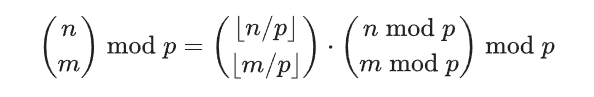

# 组合数

## 几种方法

### 计算

`c(b,a) = a! /( b! * (a-b)! )`

### 递推

`c(b,a) = c(b,a-1) + c(b-1,a-1)`

### 预处理阶乘&逆元

```c++
mod
fact[i] = !i
infact[i] = fact[i]` = (!i)`
c(b,a) = fact[a] * infact[b] * infact[a-b]
```

### 卢卡斯定理



`c(b,a)%p = c(b/p,a/p)%p * c(b%p,a%p)%p`

## 组合恒等式

有几个常见的组合恒等式，具体可见[史济怀编著的 组合恒等式](http://press.ustc.edu.cn/sites/default/files/fujian/field_tushuyangzhang/20111221/%E6%A0%B7%E7%AB%A0%20%E7%BB%84%E5%90%88%E6%81%92%E7%AD%89%E5%BC%8F.pdf)
