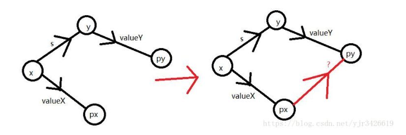
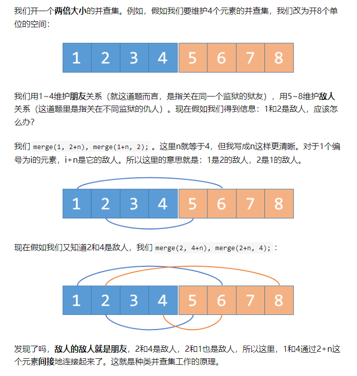
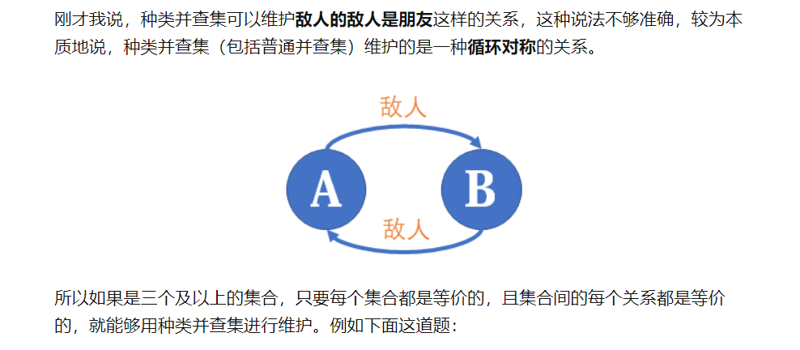

<!--
 * @Autor: violet apricity ( Zhuangpx )
 * @Date: 2022-01-26 23:14:01
 * @LastEditors: violet apricity ( Zhuangpx )
 * @LastEditTime: 2022-01-27 02:21:41
 * @FilePath: \apricitye:\桌面\ACM\数据结构\并查集\并查集.md
 * @Description:  Zhuangpx : Violet && Apricity:/ The warmth of the sun in the winter /
-->

# 并查集

并查集:Disjoint-set data structure。(或Disjoint Set Union)。

初始化:

```c++
const int N=1234;
int fa[N];
void init_DSU(int n)
{
    for(int i=0;i<=n;i++) fa[i]=i;
}
```

查找:

```c++
int find(int x)
{
    if(fa[x]==x) return x;
    else return find(fa[x]);
}
```

路径压缩，一个集合一个祖先:

```c++
int find(int x)
{
    if(fa[x]==x) return x;
    else return fa[x]=find(fa[x]);
}
```

合并:

```c++
void merge(int x,int y)
{
    int fx=fa[x],fy=fa[y];
    if(fx==fy)  return ;
    fa[fx]=fy;
}
```

按秩合并，小集合并入大集合:

```c++
const int N=1234;
int siz[N];
int fa[N];
void init_DSU(int n)
{
    for(int i=0;i<=n;i++) fa[i]=i,siz[i]=1;
}
void merge(int x,int y)
{
    int fx=find(x),fy=find(y);
    if(fx==fy)  return ;
    if(siz[fx]>siz[fy]) swap(fx,fy);    // siz[fx] <= siz[fy]
    fa[fx]=fy;
    siz[fy]+=siz[fx];
}
```

时间复杂度:

路径压缩和按秩合并之后，均摊复杂度`O(A'(n))`，其中`A(x)`为阿卡曼函数，`A'(x)`为其反函数。

空间复杂度:

开数组，`O(n)`。

自用板子:

```c++
struct dsu  // DSU
{
    std::vector<int> f;
    dsu(int n) :f(n) { iota(f.begin(), f.end(), 0); }
    int find(int x) { return f[x]==x? x : f[x]=find(f[x]); }
    void merge(int x,int y) {
        x=find(x), y=find(y);
        if(x>y) swap(x,y);
        f[y]=x;
    }
};
```

## 带权并查集

原先基础上带权。

例如边权表示距离，路径压缩和合并做对应修改:

查找，路径压缩:

```c++
int value[x];   // x和x祖先的距离
int find(int x)
{
    if(x==fa[x]) return x;
    else {
        int fx=fa[x];
        fa[x]=find(fa[x]);
        value[x]+=value[fx];
        return fa[x];
    }
}
```

合并:



```c++
int value[x];   // x和x祖先的距离
void merge(int x,int y,int val)
{
    int fx=find(x), fy=find(y);
    if(fx==fy) return ;
    fa[fx]=fy;
    vaule[fx] = vaule[y]+val-vaule[x];
}
```

## 种类并查集

维护循环对称的关系，例如**敌人的敌人是朋友**。

参考<https://zhuanlan.zhihu.com/p/97813717>

通过题目引入

## 题目

洛谷P3367并查集模板:<https://www.luogu.com.cn/problem/P3367>

洛谷P1551并查集模板2:<https://www.luogu.com.cn/problem/P1551>

洛谷P1536**数连通块**:<https://www.luogu.com.cn/problem/P1536>

洛谷P1525(NOIP2010提高组)关押罪犯(**种类并查集**):<https://www.luogu.com.cn/problem/P1525>



洛谷P2024(NOI2001)食物链(**种类并查集**):<https://www.luogu.com.cn/problem/P2024>


