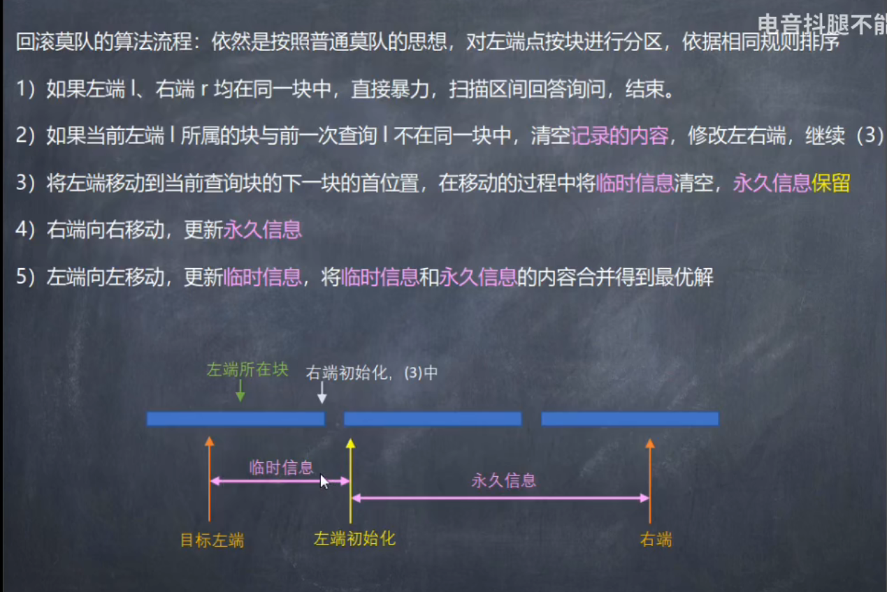
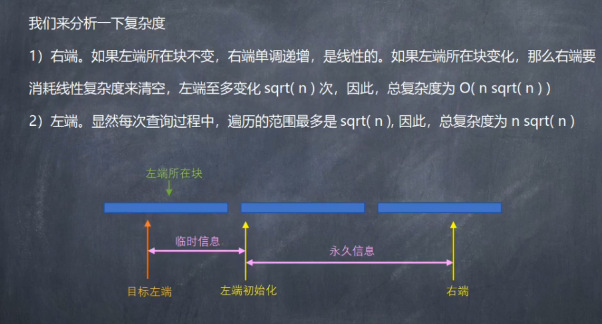

# 莫队

[罗勇军:基础莫队+带修莫队+树上莫队+几何解释](https://blog.csdn.net/weixin_43914593/article/details/108485396)

[B站西电tls:莫队](https://www.bilibili.com/video/BV1rg411u7fP?spm_id_from=333.1007.top_right_bar_window_history.content.click)

要点:分块+排序

大概有以下几种:

- **普通离线莫队**

l分块按块排序，块内按r排序

- **带修莫队**

在普通莫队基础上增加一维t，即l,r,t三轴，t表示时间/版本，把修改操作也离线

- **回滚莫队**





- **树上莫队**

欧拉序+lca+莫队

Stop Learning Useless Algorithms

## 注意点

核心思想是对暴力进行分块优化，左端分块，按块排序，块内按右端大到小排序。

单点修改是O(1)的，查询是O(nsqrt(n))的。

复杂度是O(n*sqrt(n))，因此n一般是1e5以内。

分块大小一般是sqrt(n)，带修一般是n^(2/3)实际运用时需要根据题目改变(木桶原理)。

初始:L=1,R=0

左端和右端的移动:一般先左右扩张再左右收缩，或者反过来，而不可以一边扩展一边收缩。但不同问题可能不同。

奇偶性优化:根据块序号奇偶性，块内按右端大到小-小到大两种相反排序。

带修莫队的复杂度分析：

假设块大小n1=n^(x)，n,m,t同阶，那么块的数量就是n2=n^(1-x)，数形结合，把lrt看成三维

l: 块内`n1*n=n^(1+x)` 块外`n1*n2=n`
r: 块内`n1*n=n^(1+x)` 块外`n*n2=n^(2-x)`
t: `n1*n1*n=n^(3-2x)`

要使max(1+x,2-x,3-2x)最小，由于`0<x<1`，一般取`x=2/3`最优

**值域和离散化**:莫队使用时需要注意值域，并且经常需要离散化

## 经典题型

### 无修的离线莫队处理区间内种类数

[洛谷HH的项链](https://www.luogu.com.cn/problem/P1972)-(数据加强，可能会T)

[牛客HH的项链](https://ac.nowcoder.com/acm/contest/19684/B)-(数据较弱)

```c++
/*
 * @Autor: violet apricity ( Zhuangpx )
 * @Date: 2022-03-24 19:40:28
 * @LastEditors: violet apricity ( Zhuangpx )
 * @LastEditTime: 2022-04-18 22:21:34
 * @FilePath: \apricity\Zhuangpx.cpp
 * @Description:  Zhuangpx : Violet && Apricity:/ The warmth of the sun in the winter /
 */

#pragma GCC optimize(2)
#include <bits/stdc++.h>
using namespace std;
// #define int ll
#define IOS std::ios::sync_with_stdio(false), std::cin.tie(0), std::cout.tie(0)
#define inf 0x3f3f3f3f          //1061109567=1e9
#define INF 0x3f3f3f3f3f3f3f3f  //4557430888798830399=4e18
typedef long long ll;
#define ull unsigned long long
#define UINF ~0ull
#define mod_ 99993
const int mod = 1e9+7;
const int _mod = 998244353;
const int N = 1e6+55;
const long double eps=1e-8;
ll mpow(ll a,ll b,ll m=mod){ll d=1; while(b){if(b&1)d=(d*(a%m))%m; a=((a%m)*(a%m))%m; d%=m; b>>=1;}return d%m;}
ll _mpow(ll a,ll b,ll m=_mod){ll d=1; while(b){if(b&1)d=(d*(a%m))%m; a=((a%m)*(a%m))%m; d%=m; b>>=1;}return d%m;}
inline bool _bug(bool _line=0,bool line_=0){
#ifdef LOCAL
    if(_line)cout<<"_Debug: ";if(line_)cout<<'\n';return 1;
#endif
    return 0;
}
/*  HH的项链    离线莫队处理区间内数的种类数
    https://www.luogu.com.cn/problem/P1972      会T
    https://ac.nowcoder.com/acm/contest/19684/B     能过
*/
void init(){
}
int block_size=1; //  分块大小
struct Query{
    int l,r,id;   //  [l,r]-id
    bool operator<(const Query& sec) const {    //  块序号就是左端点/块大小
        if(l/block_size!=sec.l/block_size) return l<sec.l;
        //  奇偶性优化
        if((l/block_size)%2==1) return r<sec.r;
        else return r>sec.r;
    }
}q[N];
int cnt[N];
void add(int& sum,int cur)  //  区间扩张时进行add
{
    cnt[cur]++;
    if(cnt[cur]==1) sum++;
}
void del(int& sum,int cur)  //  区间收缩时进行del
{
    cnt[cur]--;
    if(cnt[cur]==0) sum--;
}
void PX()
{
    int n;cin>>n;
    block_size = sqrt(n);   //  块大小初始化
    vector<int> a(n+1,0);
    for(int i=1;i<=n;i++) cin>>a[i];
    int m;cin>>m;
    for(int i=1;i<=m;i++) {
        cin>>q[i].l>>q[i].r; q[i].id=i;
    }
    sort(q+1,q+1+m);
    int L=1, R=0;   //  初始的L和R
    int sum=0;
    vector<int> ans(m+1,0);
    for(int i=1;i<=m;i++) {     //  注意这里的顺序
        while(L>q[i].l) add(sum,a[--L]);    //左扩
        while(R<q[i].r) add(sum,a[++R]);    //右扩
        while(L<q[i].l) del(sum,a[L++]);    //左缩
        while(R>q[i].r) del(sum,a[R--]);    //右缩
        ans[q[i].id] = sum;
    }
    for(int i=1;i<=m;i++) cout<<ans[i]<<'\n';
}
signed main()
{
#ifdef LOCAL
    freopen("E:\\ACMdream\\in.txt", "r", stdin);
    freopen("E:\\ACMdream\\out.txt", "w", stdout);
    clock_t time1 = clock();
#endif
    IOS;
    //==================================================
    ll ZPX = 1;
    // cin >> ZPX;
    init();
    while (ZPX--)   PX();
    // system("pause");
    //==================================================
#ifdef LOCAL
    std::cout << "Time:" << clock() - time1 << "ms" << std::endl;
#endif
    return 0;
}

```

### 无修的离线莫队处理区间内数的出现次数

[洛谷小z的袜子](https://www.luogu.com.cn/problem/P1494)

```c++
/*
 * @Autor: violet apricity ( Zhuangpx )
 * @Date: 2022-03-24 19:40:28
 * @LastEditors: violet apricity ( Zhuangpx )
 * @LastEditTime: 2022-04-18 22:34:15
 * @FilePath: \apricity\Zhuangpx.cpp
 * @Description:  Zhuangpx : Violet && Apricity:/ The warmth of the sun in the winter /
 */

// #pragma GCC optimize(2)
#include <bits/stdc++.h>
using namespace std;
// #define int ll
#define IOS std::ios::sync_with_stdio(false), std::cin.tie(0), std::cout.tie(0)
#define inf 0x3f3f3f3f          //1061109567=1e9
#define INF 0x3f3f3f3f3f3f3f3f  //4557430888798830399=4e18
typedef long long ll;
#define ull unsigned long long
#define UINF ~0ull
#define mod_ 99993
const int mod = 1e9+7;
const int _mod = 998244353;
const int N = 1e6+55;
const long double eps=1e-8;
ll mpow(ll a,ll b,ll m=mod){ll d=1; while(b){if(b&1)d=(d*(a%m))%m; a=((a%m)*(a%m))%m; d%=m; b>>=1;}return d%m;}
ll _mpow(ll a,ll b,ll m=_mod){ll d=1; while(b){if(b&1)d=(d*(a%m))%m; a=((a%m)*(a%m))%m; d%=m; b>>=1;}return d%m;}
inline bool _bug(bool _line=0,bool line_=0){
#ifdef LOCAL
    if(_line)cout<<"_Debug: ";if(line_)cout<<'\n';return 1;
#endif
    return 0;
}
/*  小Z的袜子   离线莫队处理区间内数的出现次数
    https://www.luogu.com.cn/problem/P1494
    区间[l,r]大小len=r-l+1  取2方案C(2,r-l+1)
    颜色i的数量是k，方案是C(2,k)，假如增加成k+1，方案是C(2,k+1)，显然增加k
*/
void init(){
}
int block_size=1; //  分块大小
struct Query{
    int l,r,id;   //  [l,r]-id
    bool operator<(const Query& sec) const {    //  块序号就是左端点/块大小
        if(l/block_size!=sec.l/block_size) return l<sec.l;
        //  奇偶性优化
        if((l/block_size)%2==1) return r<sec.r;
        else return r>sec.r;
    }
}q[N];
int cnt[N];
void add(ll& sum,int cur)  //  区间扩张时进行add
{
    sum+=cnt[cur];
    cnt[cur]++;
}
void del(ll& sum,int cur)  //  区间收缩时进行del
{
    cnt[cur]--;
    sum-=cnt[cur];
}
void PX()
{
    int n;cin>>n;
    int m;cin>>m;
    block_size = sqrt(n);   //  块大小初始化
    vector<int> a(n+1,0);
    for(int i=1;i<=n;i++) cin>>a[i];
    for(int i=1;i<=m;i++) {
        cin>>q[i].l>>q[i].r; q[i].id=i;
    }
    sort(q+1,q+1+m);
    int L=1, R=0;   //  初始的L和R
    ll sum=0;
    vector<pair<ll,ll>> ans(m+1,{0,0});
    for(int i=1;i<=m;i++) {     //  注意这里的顺序
        if(q[i].l==q[i].r) {
            ans[q[i].id] = {0,1};
            continue;
        }
        while(L>q[i].l) add(sum,a[--L]);    //左扩
        while(R<q[i].r) add(sum,a[++R]);    //右扩
        while(L<q[i].l) del(sum,a[L++]);    //左缩
        while(R>q[i].r) del(sum,a[R--]);    //右缩
        ll g=__gcd(sum,1ll*(R-L+1)*(R-L)/2);
        ans[q[i].id] = {sum/g,1ll*(R-L+1)*(R-L)/2/g};
    }
    for(int i=1;i<=m;i++) cout<<ans[i].first<<'/'<<ans[i].second<<'\n';
}
signed main()
{
#ifdef LOCAL
    freopen("E:\\ACMdream\\in.txt", "r", stdin);
    freopen("E:\\ACMdream\\out.txt", "w", stdout);
    clock_t time1 = clock();
#endif
    IOS;
    //==================================================
    ll ZPX = 1;
    // cin >> ZPX;
    init();
    while (ZPX--)   PX();
    // system("pause");
    //==================================================
#ifdef LOCAL
    std::cout << "Time:" << clock() - time1 << "ms" << std::endl;
#endif
    return 0;
}
```

### 带修的离线莫队处理处理区间内种类数

在原有l,r基础上再引入一维t，即时间或版本，把修改也离线处理

```c++
/*
 * @Autor: violet apricity ( Zhuangpx )
 * @Date: 2022-03-24 19:40:28
 * @LastEditors: violet apricity ( Zhuangpx )
 * @LastEditTime: 2022-04-19 14:47:00
 * @FilePath: \apricity\Zhuangpx.cpp
 * @Description:  Zhuangpx : Violet && Apricity:/ The warmth of the sun in the winter /
 */

// #pragma GCC optimize(2)
#include <bits/stdc++.h>
using namespace std;
// #define int ll
#define IOS std::ios::sync_with_stdio(false), std::cin.tie(0), std::cout.tie(0)
#define inf 0x3f3f3f3f          //1061109567=1e9
#define INF 0x3f3f3f3f3f3f3f3f  //4557430888798830399=4e18
typedef long long ll;
#define ull unsigned long long
#define UINF ~0ull
#define mod_ 99993
const int mod = 1e9+7;
const int _mod = 998244353;
const int N = 1e6+55;
const long double eps=1e-8;
ll mpow(ll a,ll b,ll m=mod){ll d=1; while(b){if(b&1)d=(d*(a%m))%m; a=((a%m)*(a%m))%m; d%=m; b>>=1;}return d%m;}
ll _mpow(ll a,ll b,ll m=_mod){ll d=1; while(b){if(b&1)d=(d*(a%m))%m; a=((a%m)*(a%m))%m; d%=m; b>>=1;}return d%m;}
inline bool _bug(bool _line=0,bool line_=0){
#ifdef LOCAL
    if(_line)cout<<"_Debug: ";if(line_)cout<<'\n';return 1;
#endif
    return 0;
}
/*  数颜色 / 维护队列
    https://www.luogu.com.cn/problem/P1903
    单点的带修莫队，三个轴l,r,t，第三个记录版本，根据修改来将版本区分开
*/
void init(){
}
int block_size=1; //  分块大小
struct Query{
    int l,r,t,id;   //  [l,r]-id
    int posl, posr;
    bool operator<(const Query& sec) const {
        if(posl!=sec.posl) return l<sec.l;
        if(posr!=sec.posr) return r<sec.r;
        return t<sec.t;
    }
}q[N];
int a[N];
int cnt[N];
int pos[N]; //  pos[t]记录版本号为t的更新(修改)的位置(下标)号
int nxt[N]; //  nxt[t]记录t版本修改为何，暂存版本t兑换信息，新换久要把旧的存回来，旧换新要把新的存回来
int cntq,cntr;  //  询问和修改的次数
void add(int& sum,int cur)  //  区间扩张时进行add
{
    if(++cnt[cur]==1) sum++;
}
void del(int& sum,int cur)  //  区间收缩时进行del
{
    if(--cnt[cur]==0) sum--;
}
void work(int L,int R,int& sum,int cur)  //  版本改变
{
    if(L<=pos[cur]&&pos[cur]<=R) {  //  版本t修改的位置在当前[l,r]可能对答案产生影响
        if(--cnt[a[pos[cur]]]==0) sum--;
        if(++cnt[nxt[cur]]==1) sum++;
    }
    swap(nxt[cur],a[pos[cur]]); //  注意这里是交换
}
void PX()
{
    int n;cin>>n;
    int m;cin>>m;
    block_size = pow(1.0*n,2.0/3.0);   //  块大小初始化
    for(int i=1;i<=n;i++) cin>>a[i];
    for(int i=1;i<=m;i++) {
        char op;cin>>op;
        if(op=='Q') {
            cntq++;
            cin>>q[cntq].l>>q[cntq].r;  //  查询区间
            q[cntq].id=cntq;    //  查询id
            q[cntq].t=cntr;     //  查询的版本号
            q[cntq].posl=q[cntq].l/block_size;  //  左分块
            q[cntq].posr=q[cntq].r/block_size;  //  右分块
        } else {
            cntr++;
            cin>>pos[cntr]>>nxt[cntr];  //  版本t，修改位置pos[t]，修改为nxt[t]
        }
    }
    sort(q+1,q+1+cntq);
    int sum=0;
    int L=1, R=0, t=0;   //  初始的L和R和t
    vector<int> ans(cntq+1,0);
    for(int i=1;i<=cntq;i++) {     //  注意这里的顺序
        while(L>q[i].l) add(sum,a[--L]);    //左扩
        while(R<q[i].r) add(sum,a[++R]);    //右扩
        while(L<q[i].l) del(sum,a[L++]);    //左缩
        while(R>q[i].r) del(sum,a[R--]);    //右缩
        while(t<q[i].t) work(L,R,sum,++t);  //版本前滚
        while(t>q[i].t) work(L,R,sum,t--);  //版本回退
        ans[q[i].id]=sum;
    }
    for(int i=1;i<=cntq;i++) cout<<ans[i]<<'\n';
}
signed main()
{
#ifdef LOCAL
    freopen("E:\\ACMdream\\in.txt", "r", stdin);
    freopen("E:\\ACMdream\\out.txt", "w", stdout);
    clock_t time1 = clock();
#endif
    IOS;
    //==================================================
    ll ZPX = 1;
    // cin >> ZPX;
    init();
    while (ZPX--)   PX();
    // system("pause");
    //==================================================
#ifdef LOCAL
    std::cout << "Time:" << clock() - time1 << "ms" << std::endl;
#endif
    return 0;
}
```

## 回滚莫队处理区间内重要数最大值(数值*数值出现的次数)

```c++
/*
 * @Autor: violet apricity ( Zhuangpx )
 * @Date: 2022-03-24 19:40:28
 * @LastEditors: violet apricity ( Zhuangpx )
 * @LastEditTime: 2022-04-19 17:36:10
 * @FilePath: \apricity\Zhuangpx.cpp
 * @Description:  Zhuangpx : Violet && Apricity:/ The warmth of the sun in the winter /
 */

#pragma GCC optimize(2)
#include <bits/stdc++.h>
using namespace std;
// #define int ull
#define int ll
#define IOS std::ios::sync_with_stdio(false), std::cin.tie(0), std::cout.tie(0)
#define inf 0x3f3f3f3f          //1061109567=1e9
#define INF 0x3f3f3f3f3f3f3f3f  //4557430888798830399=4e18
typedef long long ll;
#define ull unsigned long long
#define UINF ~0ull
#define mod_ 99993
const int mod = 1e9+7;
const int _mod = 998244353;
const int N = 1e6+55;
const long double eps=1e-8;
ll mpow(ll a,ll b,ll m=mod){ll d=1; while(b){if(b&1)d=(d*(a%m))%m; a=((a%m)*(a%m))%m; d%=m; b>>=1;}return d%m;}
ll _mpow(ll a,ll b,ll m=_mod){ll d=1; while(b){if(b&1)d=(d*(a%m))%m; a=((a%m)*(a%m))%m; d%=m; b>>=1;}return d%m;}
inline bool _bug(bool _line=0,bool line_=0){
#ifdef LOCAL
    if(_line)cout<<"_Debug: ";if(line_)cout<<'\n';return 1;
#endif
    return 0;
}
/*  历史研究
    https://atcoder.jp/contests/joisc2014/tasks/joisc2014_c
    回滚莫队 求区间内重要的数最大值 重要的数指 数值*数值出现次数
    1. l,r在一个块，暴力查询
    2. l,r不同块，维护L在l在下一个块开头位置，R线性右移
       [l,L-1]为临时信息，[L,R]为全局信息
       查询时:
       q[i+1].l!=q[i].l，先回滚，再查询赋L，R
       q[i+1].l==q[i].l，那么继续R右移，更新临时信息[l,L-1]，然后信息合并
    值域很大，需离散化
*/
void init(){
}
int block_size=1; //  分块大小
struct Query{
    int l,r,id;   //  [l,r]-id
    int posl, posr;
    bool operator<(const Query& sec) const {
        if(posl!=sec.posl) return l<sec.l;
        return r<sec.r;
    }
}q[N];
int a[N];
int val[N], s[N];
int cnt[N]; //  全局信息cnt
int tempcnt[N]; //  临时信息cnt
int brucnt[N];  //  cnt for brute
// map<int,int> cnt; //  全局信息cnt
// map<int,int> tempcnt; //  临时信息cnt
// map<int,int> brucnt;  //  cnt for brute
ll brute(int l,int r)  //  l,r在一个块 暴力查询 最高O(sqrt(n))
{
    ll res=0;
    for(int i=l;i<=r;i++) {
        brucnt[a[i]]++;
        res=max(res,1ll*brucnt[a[i]]*val[i]);
    }
    for(int i=l;i<=r;i++) brucnt[a[i]]=0;
    return res;
}
void PX()
{
    int n;cin>>n;
    int m;cin>>m;
    block_size = sqrt(n);   //  块大小初始化
    for(int i=1;i<=n;i++) cin>>a[i],s[i]=val[i]=a[i];
    //离散化
    sort(s+1,s+1+n);
    int sz=unique(s+1,s+1+n)-s-1;
    for(int i=1;i<=n;i++) a[i]=lower_bound(s+1,s+1+n,a[i])-s;
    //
    for(int i=1;i<=m;i++) {
        cin>>q[i].l>>q[i].r;
        q[i].id=i;
        q[i].posl=q[i].l/block_size;
        q[i].posr=q[i].r/block_size;
    }
    sort(q+1,q+1+m);
    ll maxn=0;
    int L=1, R=0;   //  初始的L和R
    vector<ll> ans(m+1,0);
    for(int i=1;i<=m;i++) {     //  注意这里的顺序
        if(q[i].posl==q[i].posr) {  //  lr在一个块 暴力
            ans[q[i].id]=brute(q[i].l,q[i].r);
            continue;
        }
        if((q[i].posl+1)*block_size!=L) {   //  在另一个块 进行回滚
            maxn=0;
            while(R>=L) cnt[a[R]]=0,R--;    //  回滚
            L=(q[i].posl+1)*block_size;
            R=L-1;
        }
        while(R<q[i].r) {
            ++R;
            cnt[a[R]]++;
            maxn=max(maxn,cnt[a[R]]*val[R]);
        }
        ll tempmaxn=maxn;   //  临时信息
        for(int j=q[i].l;j<=L-1;j++) {
            tempcnt[a[j]]++;
            tempmaxn=max(tempmaxn,(cnt[a[j]] + tempcnt[a[j]] )*val[j] );  //  信息合并
        }
        for(int j=q[i].l;j<=L-1;j++) {
            tempcnt[a[j]]=0;
        }
        ans[q[i].id]=tempmaxn;
    }
    for(int i=1;i<=m;i++) cout<<ans[i]<<'\n';
}
signed main()
{
#ifdef LOCAL
    freopen("E:\\ACMdream\\in.txt", "r", stdin);
    freopen("E:\\ACMdream\\out.txt", "w", stdout);
    clock_t time1 = clock();
#endif
    IOS;
    //==================================================
    ll ZPX = 1;
    // cin >> ZPX;
    init();
    while (ZPX--)   PX();
    // system("pause");
    //==================================================
#ifdef LOCAL
    std::cout << "Time:" << clock() - time1 << "ms" << std::endl;
#endif
    return 0;
}

```
