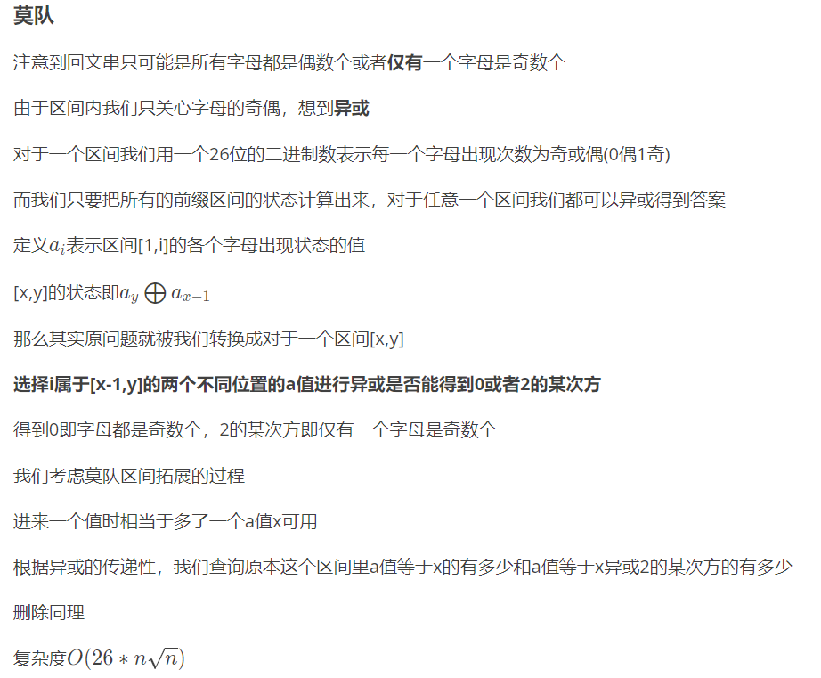

<!--
 * @Autor: violet apricity ( Zhuangpx )
 * @Date: 2022-04-22 09:41:23
 * @LastEditors: violet apricity ( Zhuangpx )
 * @LastEditTime: 2022-04-22 14:44:55
 * @FilePath: \apricitye:\桌面\ACM\数据结构\莫队\题单.md
 * @Description:  Zhuangpx : Violet && Apricity:/ The warmth of the sun in the winter /
-->

# 莫队题单

## 专题

- <https://vjudge.net/contest/490329>

## 散题

- 1.<https://blog.nowcoder.net/n/9f31305af365466ca25cf90d1d159a7c>

- 2.<https://www.luogu.com.cn/problem/P1494>

- 3.<https://www.luogu.com.cn/problem/P1903>

- 4.<https://www.luogu.com.cn/problem/P2709>

- 5.<https://www.luogu.com.cn/problem/P3604>

注意这题应该先让L对齐再让R对齐

