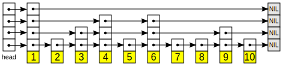

<!--
 * @Autor: violet apricity (zpx)
 * @Date: 2021-08-26 14:51:01
 * @LastEditors: violet apricity (zpx)
 * @LastEditTime: 2021-09-11 15:19:15
 * @FilePath: \apricitye:\桌面\ACM\数据结构\跳表\跳表.md
 * @Description: Violet acm && Apricity:/ The warmth of the sun in the winter /
-->

# 跳表

先贴上一篇[比较详细的文章](https://www.jianshu.com/p/9d8296562806)，[另一篇](https://lotabout.me/2018/skip-list/)

## 简介

跳表即跳跃列表(SkipList)，跳表存储一个包含n个元素的有序序列，期望的空间复杂度是```O(n)```的，而查询，插入和删除操作的期望时间复杂度都是```O(logn)```的。

以下内容摘自维基百科：
快速的查询效果是通过维护一个多层次的链表实现的，且与前一层（下面一层）链表元素的数量相比，每一层链表中的元素的数量更少（见右下角示意图）。一开始时，算法在最稀疏的层次进行搜索，直至需要查找的元素在该层两个相邻的元素中间。这时，算法将跳转到下一个层次，重复刚才的搜索，直到找到需要查找的元素为止。跳过的元素的方法可以是随机性选择或确定性选择，其中前者更为常见。

我们知道链表的查询比较繁琐，跳表就是查询是跳跃着而不是挨个查询，实现跳跃查询的方法是在原有链表往上多加若干层，每层间隔地取下一层的元素，查询时从上往下查询从而实现跳跃查询。

对层次进行合理安排也可使之成为可二分查找的链表。



查询如下图：


至于分层的标准，一般对于当前层某个节点在上一层出现的概率设置为定值```p```(通常取1/2或1/4)，


## 复杂度

复杂度证明参考[oiwiki](https://oi-wiki.org/ds/skiplist/#_2)


## 层数的获取

跳表层数的获取通过随机的方式，当数据够大时视为均匀。

总的来说跳表原理和效率都很优秀，但是实现比较困难。
