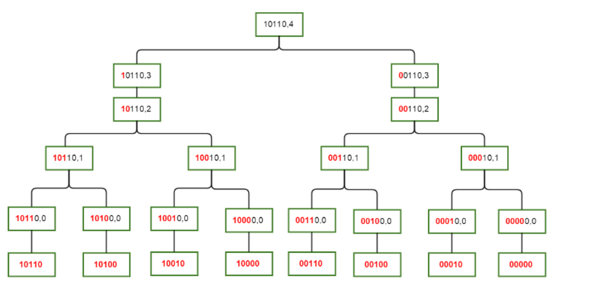

<!--
 * @Autor: violet apricity ( Zhuangpx )
 * @Date: 2022-01-27 21:16:31
 * @LastEditors: violet apricity ( Zhuangpx )
 * @LastEditTime: 2022-04-27 08:53:21
 * @FilePath: \apricitye:\桌面\ACM\算法Algorithm\动态规划dp\SOSdp\SOSdp.md
 * @Description:  Zhuangpx : Violet && Apricity:/ The warmth of the sun in the winter /
-->

# SOSdp

原文来自cf:<https://codeforces.com/blog/entry/45223>

两篇不错的翻译:[翻译1](https://blog.csdn.net/qq_35577488/article/details/114663807s),[翻译2](https://blog.csdn.net/weixin_38686780/article/details/100109753?spm=1001.2101.3001.6661.1&utm_medium=distribute.pc_relevant_t0.none-task-blog-2%7Edefault%7EBlogCommendFromBaidu%7ERate-1.pc_relevant_default&depth_1-utm_source=distribute.pc_relevant_t0.none-task-blog-2%7Edefault%7EBlogCommendFromBaidu%7ERate-1.pc_relevant_default&utm_relevant_index=1)

[西电tls的视频讲解](https://www.bilibili.com/video/BV1L64y1R75n)

## 介绍

SOSdp,全称是`Sum Over Subsets dp`，顾名思义就是**子集前缀和dp**，个人理解是高维前缀和+状压dp。

通常有二进制表示的集合`mark`，那么它的子集就是满足`i&mark==i`或`i|mark==mark`的所有集合`i`。
现在要考虑的问题就是从子集去更新超集。

注意下述说的数权[0,2^N-1]，一共有N位 [0,N-1]，从右向左，从0开始数

如果是朴素的枚举，那就是`O(4^N)`的，枚举超集和子集分别`O(2^N)`

```c++
/*  Maxn bits = N   Val: [0,2^N-1]
    Init: A[..]   Update: F[..]
*/
for (int mark = 0; mark < (1 << N); mark++) {
    for (int i = 0; i < (1 << N); i++) {
        if (i & mark == i) {
            F[mark] <- A[i];    //  eg: add
        }
    }
}
```

显然有很多多余，可以稍微优化一下，下面是复杂度为`O(N^3)`的优化

```c++
/*  Maxn bits = N   Val: [0,2^N-1]
    Init: A[..]   Update: F[..]
*/
//  iterate mark
for (int mark = 0; mark < (1 << N); mark++) {
    //  Init subset
    F[mark] = A[0];
    //  iterate subset of mark
    for (int i = mark; i > 0; i = (i-1)&mark) { //  注意这里i的变化
        F[mark] <- A[i];    //  ed: add
    }
}
```

把dp考虑在内，就有复杂度为`O(N*logN)`的`SOSdp`

考虑`dp[mark][i]`:满足`x&mark==x&&x^mark<2^(i+1)`的`A[x]`的状态“和”，也就是说x是mark的子集且x和mark**只有前i个位是不同的**(从低往高)。

如果mark的第i位为0，那么它只能从当前i位为0的下一个状态转移来，否则当前i为为1的下一个状态也能转移来。

那么就有转移方程:

```c++
dp[mark][i] = dp[mark][i-1]                             if mark&(2^i)==0
dp[mark][i] = dp[mark][i-1] (+) dp[mark^(2^i)][i-1]     if mark&(2^i)==(2^i)
```

如下图:



```c++
//  枚举集合mark
for(int mask = 0; mask < (1<<N); ++mask){
    //  N个位，从右开始数前[0,N-1]位
    dp[mask][-1] = A[mask];     //  初始化初状态前-1位
    for(int i = 0;i < N; ++i){  //  枚举前i位
        if(mask & (1<<i))
            dp[mask][i] = dp[mask][i-1] (+) dp[mask^(1<<i)][i-1];
        else
            dp[mask][i] = dp[mask][i-1];
    }
    F[mask] = dp[mask][N-1];    //  末状态前N-1位
}
//  内存优化
for(int i = 0; i<(1<<N); ++i)   F[i] = A[i];    //  初态
for(int i = 0;i < N; ++i) {     //  前[0,N-1]位
    for (int mask = 0; mask < (1 << N); ++mask) {
        //  F[mark]已经包含当前i位为0的信息 只需判断是否需要并上当前i位为1的信息
        if (mask & (1 << i)) F[mask] (+)= F[mask ^ (1 << i)];
    }
}
```
