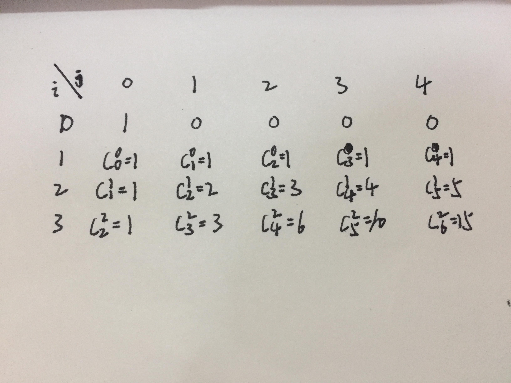
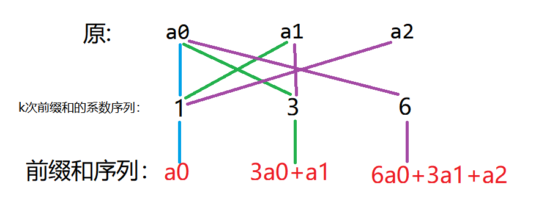

# 前缀和&差分

## 前缀和

前缀和是一种预处理，能减少查询复杂度，大致可以理解为**序列的前n项和**。即：
$$
sum[n]=sum(a[i]) (i<=n)
$$
可以用来求区间和。如a[l,r]=sum[r]-sum[l-1]。

### STL里的前缀和

c++标准库提供了 [`std::partial_sum`](https://zh.cppreference.com/w/cpp/algorithm/partial_sum)函数，定义于头文件 `<numeric>` 中。

假设要处理的序列为a，前缀和存储在arr中，那么有以下几种重载：

```c++
//1.partial_sum(容器要计算的起始位置，容器要计算的结束位置，结果存放的起始位置)
std::partial_sum(a.begin(),a.end(),arr)

//2.partial_sum(容器要计算的起始位置，容器要计算的结束位置，结果存放的起始位置，自定义函数)
std::partial_sum(a.begin(),a.end(),arr,func)

//3.partial_sum(容器要计算的起始位置，容器要计算的结束位置，结果存放的起始位置)
std::partial_sum(a.begin(),a.end(),arr.begin())

//4.partial_sum(容器要计算的起始位置，容器要计算的结束位置，结果存放的起始位置，自定义函数)
std::partial_sum(a.begin(),a.end(),arr.begin(),func)
```

例子：

```c++
#include<numeric>
#include<iostream>
int a[55];
int arr[10];
int func(int x,int y){
    return x-y+1;
}
int main()
{
    //IOS
    int n=10;
    for(int i=0;i<n;i++)a[i]=i+1;
    std::partial_sum(a,a+5,arr+2,func);
    for(auto i:arr)std::cout<<i<<' ';
    puts("");
    return 0;
}
```

对比：

```c++
1 2 3 4  5  6  7 8 9 10
0 0 1 0 -2 -5 -9 0 0 0
```

### 基于容斥定理计算二维/多维前缀和

多维前缀和的普通求解方法几乎都是基于**容斥原理**。

比如我们有这样一个矩阵 ，可以视为二维数组：

```c++
1 2 4 3
5 1 2 4
6 3 5 9
```

我们定义一个矩阵 sum，sum[x,y]=(x,y)+(a,b)，其中(a,b)表示位于(x,y)左边及上边的数。

那么这个矩阵长这样：

```c++
1  3  7  10
6  9  15 22
12 18 29 45
```

**第一个问题**就是递推求sum[i,j]的过程：
$$
sum[i,j]=sum[i-1,j]+sum[i,j-1]-sum[i-1,j-1]+a[i,j]。
$$
代码就是这样子：

```c++
for(int i=1;i<=n;i++)
    for(int j=1;j<=m;j++)
         b[i][j]=b[i-1][j]+b[i][j-1]-b[i-1][j-1]+a[i][j];
```

**第二个问题**就是如何应用，譬如求(x1,y1)-(x2,y2)子矩阵的和。

那么，根据类似的思考过程，易得答案为：
$$
sum[x2,y2]-sum[x1-1,y2]-sum[x2,y1-1]+sum[x1-1,y1-1]。
$$
当维数增加时同样可以类似的用容斥解决。

比如说**三维**：

```c++
for(int i=1;i<=n;i++)
    for(int j=1;j<=m;j++)
        for(int k=1;k<=p;k++)
              b[i][j][k]=b[i-1][j][k]+b[i][j-1][k]+b[i][j][k-1]
                            -b[i-1][j-1][k]-b[i-1][j][k-1]-b[i][j-1][j-1]
                            +b[i-1][j-1][k-1]+a[i][j][k];
```

### 基于DP计算高维前缀和（sosdp）

基于容斥原理来计算高维前缀和的方法，其优点在于形式较为简单，无需特别记忆，但当维数升高时，其复杂度较高。这里介绍一种基于DP计算高维前缀和的方法。该方法即通常语境中所称的 **高维前缀和**。

先讨论**二维**：

除了容斥也可以一维一维地求：

```c++
for(int i = 1; i <= n; i++)
    for(int j = 1; j <= n; j++)
        a[i][j] += a[i - 1][j];
for(int i = 1; i <= n; i++)
    for(int j = 1; j <= n; j++)
        a[i][j] += a[i][j - 1];
```

那么类似的我们可以推到**三维**：

```c++
for(int i = 1; i <= n; i++)
    for(int j = 1; j <= n; j++)
        for(int k = 1; k <= n; k++)
            a[i][j][k] += a[i - 1][j][k];
for(int i = 1; i <= n; i++)
    for(int j = 1; j <= n; j++)
        for(int k = 1; k <= n; k++)
            a[i][j][k] += a[i][j - 1][k];
for(int i = 1; i <= n; i++)
    for(int j = 1; j <= n; j++)
        for(int k = 1; k <= n; k++)
            a[i][j][k] += a[i][j][k - 1];
```

那么正题来了，多维前缀和也是同样的道理，核心思想也是一维一维地求，可以类比二维模拟一下。

以三维为例子把两种方法放在一起:

```c++
for (int i = 1; i <= n; i++) {
    for (int j = 1; j <= n; j++) {
        for (int k = 1; k <= n; k++) {
            a[i][j][k] += a[i][j][k - 1];
        }
    }
}
for (int i = 1; i <= n; i++) {
    for (int j = 1; j <= n; j++) {
        for (int k = 1; k <= n; k++) {
            a[i][j][k] += a[i][j - 1][k];
        }
    }
}
for (int i = 1; i <= n; i++) {
    for (int j = 1; j <= n; j++) {
        for (int k = 1; k <= n; k++) {
            a[i][j][k] += a[i - 1][j][k];
        }
    }
}
//======
for (int i = 1; i <= n; i++) {
    for (int j = 1; j <= n; j++) {
        for (int k = 1; k <= n; k++) {
            a[i][j][k] += a[i][j][k - 1] + a[i][j - 1][k] + a[i - 1][j][k];
            a[i][j][k] -= a[i][j - 1][k - 1] + a[i - 1][j - 1][k] + a[i - 1][j][k - 1];
            a[i][j][k] += a[i - 1][j - 1][k - 1];
        }
    }
}
```

上面所进行的n次计算就是所谓的**降维**，进行k次降维即可得到k维前缀和。

#### 基于集合的广义前缀和

接下来考虑集合上的前缀和问题，**对于一个大小为n的集合S，那么它的n维前缀和就是子集的和，它的n维后缀和就是超集的和**。

对于一个集合里的元素，只有选和不选两种方案，那么就能用01来表示，于是可以将某个集合表示为一个n位二进制数，抽象一下，就是在n维坐标下的某个点，用n位二进制数表示，那么它就是表示某个集合，某个维度就某个元素，某个维度下的值就是这个元素的选择情况

于是可以得到前缀和和后缀和的计算方法

这也是常说的**SOSDP**，来源于cf的一篇博客，翻译:<https://blog.csdn.net/weixin_38686780/article/details/100109753>，原文:<https://codeforces.com/blog/entry/45223>

```c++
for(int j = 0; j < n; j++)
    for(int i = 0; i < 1 << n; i++)
        if(i >> j & 1) f[i] += f[i ^ (1 << j)];
```

伪码表示就是如下:

```c++
for (i : 空间元素)
    sum[i] = a[i];
for (i = 1; i <= k; i++)
    for (j : 空间元素)
        sum[j] += sum[k] [k的第i维 + 1 = j]
```

例题:

```c++
/*
    牛客竞赛数据结构专题班前缀和练习题 智乃酱的子集与超集 <https://ac.nowcoder.com/acm/contest/19483/B>
    高维前缀和:每一维做一次前缀和维护，相当于降维，那么k维只需要做k次降维
    考虑每个物体作为一个维度，每个维度两个选值，0表示不选，1表示不选
    那么n维空间下的一个点就是n个物体选择的一个集合
    维护前缀和即为某个集合的所有子集的价值之和
    维护后缀和即为某个集合的所有超集的价值之和
*/
const int _N = 30;
const int _S = 1<<20;   // n<=20
ll n,m,k;
ll a[_N],pres[_S],sufs[_S];
void PX()
{
    cin>>n>>m;
    for(ll i=0;i<n;i++)cin>>a[i];
    // init
    for(ll i=0;i<1<<n;i++){ // i:2^n 集合
        ll s=0;
        for(ll j=0;j<n;j++){  // j:n 元素
            if(i&(1<<j)) s^=a[j];
        }
        pres[i]=sufs[i]=s;
    }
    // 高维前/后缀和
    for(ll i=0;i<n;i++){    // n次降维
        for(ll j=0;j<1<<n;j++){
            // 当前维度i(元素)  枚举集合j
            // 若集合j在第i维值为1 则集合j包含物品i 否则不包含物品i
            // 那么j^(1<<i)和j 只相差一个物品i 考虑j是否包含物品i即可
            if(j&(1<<i))pres[j]+=pres[j^(1<<i)];    // j为超集
            else sufs[j]+=sufs[j^(1<<i)];           // j为子集
        }
    }
    while(m--){
        cin>>k;
        ll ans=0;   // 集合
        while(k--){
            ll d;cin>>d;
            ans=ans|(1<<d-1);   //  选上物品d 注意d是从1开始 需要减一
        }
        cout<<pres[ans]<<' '<<sufs[ans]<<'\n';
    }
    cout<<'\n';
}
```

### 树上前缀和

（待补充）

## 差分

将前缀和和差分放在一起，因为它们两可以说是相对的策略，差分可以看作求和的逆运算。即：
$$
if(n==1)b[n]=a[n]
$$

$$
if(n>=2)b[n]=a[n]-a[n-1]
$$

### 简单性质

- 设sum为b前缀和，则：

$$
a[n]=sum[n]
$$

​也就是说原**数组A的差分数组是B，数组B的前缀和数组是A。**

- 现在有操作：
  $$
  a[i]=a[i]+d :(l<=i<=r)
  $$

​则：

$$
b[l]=b[l]+d
$$

$$
b[r+1]=b[r]-d:(if(r+1<=n))
$$

也就是说**原数组区间加相当于差分数组边界加减**

经典运用:NOIP2013积木大赛(<https://ac.nowcoder.com/acm/contest/19483/I>)

### STL里的差分

C++ 标准库中实现了差分函数 [`std::adjacent_difference`](https://zh.cppreference.com/w/cpp/algorithm/adjacent_difference)，定义于头文件 `<numeric>` 中。

方法与[`std::partial_sum`](https://zh.cppreference.com/w/cpp/algorithm/partial_sum)类似，示例如下：

```c++
#include<numeric>
#include<iostream>
int a[55];
int c[10];
int b[10];
int func(int x,int y){
    return x-y+1;
}
int main()
{
    int n=10;
    for(int i=0;i<n;i++)a[i]=i+1;
    std::adjacent_difference(a,a+5,c+2,func);
    std::adjacent_difference(a,a+5,b+2);
    std::cout<<"eg.1:";
    for(auto i:c)std::cout<<i<<' ';
    puts("");
    std::cout<<"eg.2:";
    for(auto i:b)std::cout<<i<<' ';
    puts("");
    return 0;
}
```

对比：

```c++
   a:1 2 3 4 5 6 7 8 9 10
eg.1:0 0 1 2 2 2 2 0 0 0
eg.2:0 0 1 1 1 1 1 0 0 0
```

### 树上差分

（待补充）

### 点差分

（待补充）

### 边差分

（待补充）

## 前缀和+差分结合与进阶

**前缀和和差分是可逆的两个过程**。

### 多项式前缀和

考虑这样的操作，对于一个数组，每次选一个起点位置，向后分别加1，加i，加i^2

```c++
a:0 0 0 0  0  0  0
a:0 1 1 1  1  1  1
a:0 1 2 3  4  5  6
a:0 1 4 9 16 25 36
//====
d:0 0 0 0 0 0 0
d:0 1 0 0 0 0 0
d:0 1 1 1 1 1 1 -> dd:0 1 0 0 0 0 0
d:0 1 3 5 7 9 11-> dd:0 1 2 2 2 2 2 -> ddd:0 1 1 0 0 0 0
```

于是可以分别做出若干次的差分与对应次数前缀和还原

例题:小w的糖果<https://ac.nowcoder.com/acm/contest/19483/H>

把上述过程拓展，设有多项式`f(x)=a[k]*x^k+a[k-1]*x^(k-1)+...+a[1]*x+a[0]`，每次对一个区间[l,r]依次进行一个`a[l+i-1]+=f(i)`的操作。

容易发现对`[l,r]+=f[i]`相当于对`[l,n]+=f[i]`和`[r+1,n]-=f[r-l+1+i]`

引入这样一个数学定理:**最高项为n次的n阶多项式做n+1次差分后余项为常数(0)**

并且再继续进行差分明显不会影响，也就是**做n+1以上次差分能保证余项为常数(0)**。

例题:智乃酱的静态数组维护问题多项式<https://ac.nowcoder.com/acm/contest/19483/D>

重复做差分和前缀和，当项次数较低时适用，如果项的次数较高，则需要加速，对其进行拓展，也就是高阶前缀和

### 高阶前缀和

考虑对这样一个序列求高阶前缀和:

```c++
   0 1 2 3 4
a0:1 0 0 0 0
a1:1 1 1 1 1
a2:1 2 3 4 5
a3:1 3 6 10 15
```

把他们看成二维矩阵`b[i][j]`，容易得到递推式:`b[i][j]=b[i-1][j]+b[i][j-1]`

这个式子的含义等同于在二维空间下从`[1,0]`出发每次向右或下移动到达`[i,j]`的方案数，答案就是一个组合数`b[i][j]=C(i-1,i+j-1)`(向下`i-1`次，向右`j`次的排列)

于是可以通过组合数递推在`O(n)`下得到`a[i]`做`k`阶前缀和后的系数序列`b[i]`


**通过系数序列(首位元素)和原序列的卷积可以得到高阶前缀和系列**，以三阶为例:



于是可以`O(n^2)`求高阶前缀和，此外还可以通过**卷积**(`ntt`)进行`o(nlogn)`求卷积

引入这一数学定理:**序列做前缀和取的模数大于序列的长度，那么前缀和序列会以长度为模数的循环节循环出现**

通过同余的知识可知，对于a,b满足`a%p=b%p`即ab同余，又由前可知**差分和前缀和可逆**，那么`-k`次前缀和，也就是`k`次差分，也就是`(p-k)%p`次前缀和，于是可以得到:**假如ab同余，那么在模p下做a次差分等同于做b次前缀和**。

例题:智乃酱的前缀和与差分<https://ac.nowcoder.com/acm/contest/19483/C>
